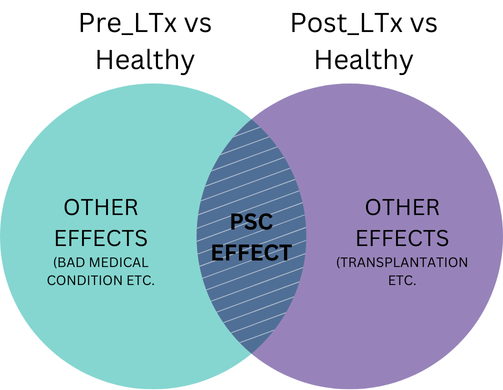

# Introduction

## About

**Pre_LTx vs Post_LTx vs Healthy analysis on merged data**

-   Alpha diversity – Richness, Shannon, Simpson, and Pielou indices
    tested by linear fixed effect or mixed effect model (group effect,
    country effect, interaction effect)

-   Beta diversity – PERMANOVA (group effect, country effect,
    interaction effect), PCA visualization

-   Differential abundance testing:

    -   o Group effect – linDA + MaAsLin2 intersection

    -   o Country effect – taxa with significant interaction effect were
        excluded based on individual post-hoc analysis. Taxa had to have
        the same direction in both countries

-   ML models, trained and validated using out-of-sample bootstrap (500
    resamplings):

   - o ENET

   - o kNN

   - o GBoost

   - o RF

------------------------------------------------------

Pairwise comparisons:

**Pre_ltx vs Healthy** – an effect of disease, liver cirrhosis and
overall bad clinical condition

**Pre_ltx vs post_ltx** – an effect of transplantation + general
improvement of the clinical state

**Post_ltx vs Healthy** – does LTx lead to „healthy microbiome”?

**Report structure** The analysis is divided into two segments: terminal
ileum and colon. Each part begins with data filtering, where sequencing
depth is assessed and nearZeroVar() is applied to remove taxa with no
variance in the dataset. This is followed by a series of analytical
steps:

1.  Alpha diversity

2.  Beta diversity

3.  Univariate testing

4.  Machine learning models training and validation

At the end of the analysis, a brief summary of the results is provided.

**Importing libraries and custom functions built for this analysis**

```{r,warning=FALSE}
source("custom_functions.R")
```

## Clinical characteristics

```{r,warning=FALSE}
clinical_char <- read.xlsx("../results/clinical_characteristics.xlsx",
                           colNames = FALSE)
colnames(clinical_char) <- clinical_char[3,]
clinical_char <- clinical_char[-c(1,2,3),]
header_groups <- c(" " = 2, "HC" = 2, "pre_LTx" = 2, "post_LTx_non-rPSC"=2, "post_LTx_rPSC"=2)
```

```{r,warning=FALSE}
knitr::kable(clinical_char, align="l", escape=FALSE,digits=3) %>% 
  kable_styling(bootstrap_options = c("hover", "striped", "responsive")) %>% 
  kable_styling(full_width = TRUE) %>%
  add_header_above(header_groups)
```

## Data Import

Importing ASV, taxa and metadata tables for both Czech and Norway
samples.

**Czech**

```{r,warning=FALSE}
path = "../../data/analysis_ready_data/ikem/"
asv_tab_ikem <- as.data.frame(fread(file.path(path,"asv_table_ikem.csv"),
                                    check.names = FALSE))
taxa_tab_ikem <- as.data.frame(fread(file.path(path,"taxa_table_ikem.csv"),
                                     check.names = FALSE))
metadata_ikem <- as.data.frame(fread(file.path(path,"metadata_ikem.csv"),
                                     check.names = FALSE))
```

**Norway**

```{r,warning=FALSE}
path = "../../data/analysis_ready_data/norway/"
asv_tab_norway <- as.data.frame(fread(file.path(path,"asv_table_norway.csv"),
                                    check.names = FALSE))
taxa_tab_norway <- as.data.frame(fread(file.path(path,"taxa_table_norway.csv"),
                                    check.names = FALSE))
metadata_norway <- as.data.frame(fread(file.path(path,"metadata_norway.csv"),
                                    check.names = FALSE))
```

## Merging

Merging two countries based on the different matrices - Ileum, Colon.

**Terminal ileum**

```{r,warning=FALSE}
ileum_data <- merging_data(asv_tab_1=asv_tab_ikem,
                           asv_tab_2=asv_tab_norway,
                           taxa_tab_1=taxa_tab_ikem,
                           taxa_tab_2=taxa_tab_norway,
                           metadata_1=metadata_ikem,
                           metadata_2=metadata_norway,
                           segment="TI",Q="Q1")

ileum_asv_tab <- ileum_data[[1]]
ileum_taxa_tab <- ileum_data[[2]]
ileum_metadata <- ileum_data[[3]]
```

**Reads statistics**

```{r,warning=FALSE}
summary(colSums(ileum_asv_tab[,-1]))
```

**Right Colon**

```{r,warning=FALSE}
rcolon_data <- merging_data(asv_tab_1=asv_tab_ikem,
                           asv_tab_2=asv_tab_norway,
                           taxa_tab_1=taxa_tab_ikem,
                           taxa_tab_2=taxa_tab_norway,
                           metadata_1=metadata_ikem,
                           metadata_2=metadata_norway,
                           segment="right_colon",Q="Q1")

rcolon_asv_tab <- rcolon_data[[1]]
rcolon_taxa_tab <- rcolon_data[[2]]
rcolon_metadata <- rcolon_data[[3]]
```

**Reads statistics**

```{r,warning=FALSE}
summary(colSums(rcolon_asv_tab[,-1]))
```

**Left Colon**

```{r,warning=FALSE}
lcolon_data <- merging_data(asv_tab_1=asv_tab_ikem,
                           asv_tab_2=asv_tab_norway,
                           taxa_tab_1=taxa_tab_ikem,
                           taxa_tab_2=taxa_tab_norway,
                           metadata_1=metadata_ikem,
                           metadata_2=metadata_norway,
                           segment="left_colon",Q="Q1")

lcolon_asv_tab <- lcolon_data[[1]]
lcolon_taxa_tab <- lcolon_data[[2]]
lcolon_metadata <- lcolon_data[[3]]
```

**Reads statistics**

```{r,warning=FALSE}
summary(colSums(lcolon_asv_tab[,-1]))
```

# Data Analysis - Terminal ileum

```{r,warning=FALSE}
segment="terminal_ileum"
```

## Filtering

Rules:

-   sequencing depth \> 10000

-   nearZeroVar() with default settings

**Rarefaction Curve**

```{r,warning=FALSE}
path="../intermediate_files/rarecurves"
seq_depth_threshold <- 10000
```

```{r, warning=FALSE, eval = FALSE}
ps <- construct_phyloseq(ileum_asv_tab,ileum_taxa_tab,ileum_metadata)
rareres <- get_rarecurve(obj=ps, chunks=500)
save(rareres,file = file.path(path,"rarefaction_ileum.Rdata"))
```

```{r, warning=FALSE,warning=FALSE}
load(file.path(path,"rarefaction_ileum.Rdata"))

prare <- ggrarecurve(obj=rareres,
                      factorNames="Country",
                      indexNames=c("Observe")) + 
  theme_bw() +
  theme(axis.text=element_text(size=8), panel.grid=element_blank(),
        strip.background = element_rect(colour=NA,fill="grey"),
        strip.text.x = element_text(face="bold")) + 
  geom_vline(xintercept = seq_depth_threshold, 
             linetype="dashed", 
             color = "red") + 
  xlim(0, 20000)

prare
```

**Library size**

```{r, warning=FALSE, fig.width=5, fig.height=4, fig.fullwidth=TRUE,warning=FALSE}
read_counts(ileum_asv_tab, line = c(5000,10000))
```

### Sequencing depth

```{r,warning=FALSE}
data_filt <- seq_depth_filtering(ileum_asv_tab,
                                 ileum_taxa_tab,
                                 ileum_metadata,
                                 seq_depth_threshold = 10000)

filt_ileum_asv_tab <- data_filt[[1]]; alpha_ileum_asv_tab <- filt_ileum_asv_tab
filt_ileum_taxa_tab <- data_filt[[2]]; alpha_ileum_taxa_tab <- filt_ileum_taxa_tab
filt_ileum_metadata <- data_filt[[3]]; alpha_ileum_metadata <- filt_ileum_metadata

seq_step <- dim(filt_ileum_asv_tab)[1]
```

**Library size**

```{r, warning=FALSE, fig.width=5, fig.height=4, fig.fullwidth=TRUE,warning=FALSE}
read_counts(filt_ileum_asv_tab,line = c(5000,10000))
```

### NearZeroVar

```{r,warning=FALSE}
data_filt <- nearzerovar_filtering(filt_ileum_asv_tab, 
                                   filt_ileum_taxa_tab,
                                   filt_ileum_metadata)

filt_ileum_asv_tab <- data_filt[[1]]
filt_ileum_taxa_tab <- data_filt[[2]]
nearzero_step <- dim(filt_ileum_asv_tab)[1]
```

**Library size**

```{r, warning=FALSE, fig.width=5, fig.height=4, fig.fullwidth=TRUE}
read_counts(filt_ileum_asv_tab,line = c(5000,10000))
```

### Final Counts

```{r,warning=FALSE}
final_counts_filtering(ileum_asv_tab,
                       filt_ileum_asv_tab,
                       filt_ileum_metadata,
                       seq_step, 0, nearzero_step) %>% `colnames<-`("Count")
```

## Alpha diversity

Calculating Richness, Shannon, Simpson, Pielou indexes on raw
(unfiltered) rarefied data. Samples with sequencing depth \< 10000 were
excluded. Testing by linear model.

```{r,warning=FALSE}
path = "../results/Q1/alpha_diversity"
```

**Calculation**

```{r,warning=FALSE}
# Construct MPSE object
alpha_ileum_metadata$Sample <- alpha_ileum_metadata$SampleID
ileum_mpse <- as.MPSE(construct_phyloseq(alpha_ileum_asv_tab,
                                         alpha_ileum_taxa_tab,
                                         alpha_ileum_metadata))

ileum_mpse %<>% mp_rrarefy(raresize = 10000,seed = 123)

# Calculate alpha diversity - rarefied counts
ileum_mpse %<>% mp_cal_alpha(.abundance=RareAbundance, force=TRUE)
```

```{r,warning=FALSE}
alpha_div_plots <- list()

# preparing data frame
alpha_data <- data.frame(SampleID=ileum_mpse$Sample.x,
                         Observe=ileum_mpse$Observe,
                         Shannon=ileum_mpse$Shannon,
                         Simpson=ileum_mpse$Simpson,
                         Pielou=ileum_mpse$Pielou,
                         Group=ileum_mpse$Group,
                         Country=ileum_mpse$Country,
                         Patient=ileum_mpse$Patient)

# save the result
write.csv(alpha_data,file.path(path,paste0("alpha_indices_",segment,".csv")),
          row.names = FALSE)
```

### Plots

```{r, warning=FALSE, fig.width=6, fig.height=4, fig.fullwidth=TRUE}
p_boxplot_alpha <- alpha_diversity_countries(alpha_data,size = 0.5)

# save the results
alpha_div_plots[[paste(segment,"Country")]] <- p_boxplot_alpha

# see the results
p_boxplot_alpha
```

```{r, warning=FALSE,results='hide',echo=FALSE}
pdf("../figures/Q1/alpha_diversity_terminal_ileum.pdf",
    height =4,width = 7)
p_boxplot_alpha
dev.off()
```

### Linear Models

```{r,warning=FALSE}
path = "../results/Q1/alpha_diversity"
```

**Richness**

```{r,warning=FALSE}
# run model
results_model <- pairwise.lm(formula = "Observe ~ Group * Country",
                             factors=alpha_data$Group,
                             data=alpha_data)

# check interaction
if (!is.data.frame(results_model)){
  results_model_observe <- results_model[[1]]
  results_model_observe_emeans <- results_model[[2]]
} else {
  results_model_observe <- results_model
  results_model_observe_emeans <- NA
}

# save the results
pc_observed <- list(); 
pc_observed[[segment]] <- results_model_observe
```

```{r,warning=FALSE}
# see the results
knitr::kable(results_model_observe,digits = 3,
caption = "Raw results of linear model of richness estimation.")

knitr::kable(results_model_observe_emeans,digits = 3,
caption = "Raw results of independent country analysis")
```

**Shannon**

```{r,warning=FALSE}
# run model
results_model <- pairwise.lm(formula = "Shannon ~ Group * Country",
                             factors=alpha_data$Group,
                             data=alpha_data)

# check interaction
if (!is.data.frame(results_model)){
  results_model_shannon <- results_model[[1]]
  results_model_shannon_emeans <- results_model[[2]]
} else {
  results_model_shannon <- results_model
  results_model_shannon_emeans <- NA
}

# save the results
pc_shannon <- list(); 
pc_shannon[[segment]] <- as.data.frame(results_model_shannon)

```

```{r,warning=FALSE}
# see the results
knitr::kable(results_model_shannon,digits = 3,
caption = "Raw results of linear model of Shannon estimation.")

knitr::kable(results_model_shannon_emeans,digits = 3,
caption = "Raw results of independent country analysis")
```

**Simpson**

```{r,warning=FALSE}
# run model
results_model <- pairwise.lm(formula = "Simpson ~ Group * Country",
                                     factors=alpha_data$Group,
                                     data=alpha_data)

# check interaction
if (!is.data.frame(results_model)){
  results_model_simpson <- results_model[[1]]
  results_model_simpson_emeans <- results_model[[2]]
} else {
  results_model_simpson <- results_model
  results_model_simpson_emeans <- NA
}


# save the results
pc_simpson <- list(); 
pc_simpson[[segment]] <- as.data.frame(results_model_simpson)
```

```{r,warning=FALSE}
# see the results
knitr::kable(results_model_simpson,digits = 3,
caption = "Raw results of linear model of Simpson estimation.")

knitr::kable(results_model_simpson_emeans,digits = 3,
caption = "Raw results of independent country analysis")
```

**Pielou**

```{r,warning=FALSE}
# run model
results_model <- pairwise.lm(formula = "Pielou ~ Group * Country",
                                     factors=alpha_data$Group,
                                     data=alpha_data)

# check interaction

if (!is.data.frame(results_model)){
  results_model_pielou <- results_model[[1]]
  results_model_pielou_emeans <- results_model[[2]]
} else {
  results_model_pielou <- results_model
  results_model_pielou_emeans <- NA
}

# save the results
pc_pielou <- list(); 
pc_pielou[[segment]] <- as.data.frame(results_model_pielou)
```

```{r,warning=FALSE}
# see the results
knitr::kable(results_model_pielou,digits = 3,
caption = "Raw results of linear model of Pielou estimation.")

knitr::kable(results_model_pielou_emeans,digits = 3,
caption = "Raw results of independent country analysis")
```

### Saving results

```{r,warning=FALSE}
alpha_list <- list(
  Richness=pc_observed[[segment]] %>% rownames_to_column("Comparison"),
  Shannon=pc_shannon[[segment]] %>% rownames_to_column("Comparison"),
  Simpson=pc_simpson[[segment]] %>% rownames_to_column("Comparison"),
  Pielou=pc_pielou[[segment]] %>% rownames_to_column("Comparison"))
                   
write.xlsx(alpha_list, 
           file = file.path(path,paste0("alpha_diversity_results_",segment,".xlsx")))
```

## Beta diversity

Calculating Aitchison distance (euclidean distance on clr-transformed
data) at genus level (main analysis). In supplements, there are also
bray-curtis and Jaccard distance at ASV and genus levels. Testing by
PERMANOVA.

### Main analysis

**Genus level, Aitchison distance**

```{r,warning=FALSE}
level="genus"
path = "../results/Q1/beta_diversity"
```

```{r,warning=FALSE}
pairwise_aitchison_raw <- list()
pca_plots_list <- list()
```

Aggregation, filtering

```{r,warning=FALSE}
# Aggregation
genus_data <- aggregate_taxa(ileum_asv_tab,
                             ileum_taxa_tab,
                             taxonomic_level=level,
                             names=TRUE)
# Filtration
filt_data <- filtering_steps(genus_data[[1]],
                             genus_data[[2]],
                             ileum_metadata,
                             seq_depth_threshold=10000)

filt_ileum_genus_tab <- filt_data[[1]]
filt_ileum_genus_taxa <- filt_data[[2]]
filt_ileum_metadata <- filt_data[[3]]
```

##### PERMANOVA

```{r,warning=FALSE}
# prepare dataset
pairwise_df <- filt_ileum_genus_tab %>% column_to_rownames("SeqID") %>% t()

# main effect
pp_main <- pairwise.adonis(pairwise_df,
                           filt_ileum_metadata$Group,
                           covariate = filt_ileum_metadata$Country, 
                           sim.method = "robust.aitchison", p.adjust.m="BH")

# interaction
pp_int <- pairwise.adonis(pairwise_df,
                          filt_ileum_metadata$Group,
                          covariate = filt_ileum_metadata$Country, 
                          interaction = TRUE, sim.method = "robust.aitchison",
                          p.adjust.m="BH")

# tidy the results
pp_factor <- pp_main[[1]]
pp_cov <- pp_main[[2]]
pp_fac.cov <- pp_int[[3]]

cols <- c("pairs","Df","SumsOfSqs", "F.Model","R2","p.value", "p.adjusted", "sig")
colnames(pp_factor) <- cols; colnames(pp_cov) <- cols; colnames(pp_fac.cov) <- cols; 

# save raw results
pairwise_aitchison_raw[[paste(level, segment)]] <- rbind(pp_factor,pp_cov,pp_fac.cov)
```

```{r,warning=FALSE}
# see the results
knitr::kable(pp_factor,digits = 3,caption = "PERMANOVA, GROUP separation")
knitr::kable(pp_cov,digits = 3,caption = "PERMANOVA, COUNTRY separation")
knitr::kable(pp_fac.cov,digits = 3,caption = "PERMANOVA, INTERACTION GROUP:Country")
```

Interaction check

```{r,warning=FALSE}
interaction_sig <- pp_fac.cov$pairs[pp_fac.cov$p.adjusted < 0.1]

for (i in 1:length(interaction_sig)){
  group1 <- unlist(strsplit(interaction_sig[i],split = " vs "))[1]
  group2 <- unlist(strsplit(interaction_sig[i],split = " vs "))[2]
  group2 <- unlist(strsplit(group2,split = " : "))[1]
  
  result_list <- adonis_postanalysis(x=pairwise_df,
                      factors = filt_ileum_metadata$Group,
                      covariate = filt_ileum_metadata$Country, 
                      group1 = group1,
                      group2 = group2)
  print(result_list)
}

```

##### Plots

```{r,warning=FALSE}
p <- pca_plot_custom(filt_ileum_genus_tab,
                                 filt_ileum_genus_taxa,
                                 filt_ileum_metadata,
                                 show_boxplots = TRUE,
                                 variable = "Group", size=3, show_legend= FALSE)

# save the results
pca_plots_list[[paste(segment,level,"custom")]] <- p

# see the results
p
```

```{r, warning=FALSE,results='hide',echo=FALSE}
pdf("../figures/Q1/beta_diversity_terminal_ileum.pdf",
    height =5,width = 5)
p
dev.off()
```

#### Saving results

```{r,warning=FALSE}
write.xlsx(pairwise_aitchison_raw[[paste(level, segment)]], 
           file = file.path(path,
           paste0("beta_diversity_results_", segment,".xlsx")))
```

## Univariate Analysis

Using two DAA tools - linDA and Maaslin. Only the intersection of sets
selected by each tool was shown to minimize false positives. Taxa with a
significant interaction effect were excluded based on individual
post-hoc analysis of the Czech and Norwegian cohorts. Only taxa with
significant log fold change that showed the same change direction in
both countries were retained.

Main analysis is performed at genus level. In supplements, analysis is
performed at ASV and phylum levels.

### Main analysis

```{r,warning=FALSE}
level="genus"

# needed paths
path = "../results/Q1/univariate_analysis"
path_maaslin=file.path("../intermediate_files/maaslin/Q1",level)
```

```{r,warning=FALSE}
# variables
raw_linda_results_genus <- list();
raw_linda_results_genus[[segment]] <- list()
linda_results_genus <- list(); 
linda_results_genus[[segment]] <- list()

# country and interaction problems
list_country_union <- list()
list_intersections <- list()
list_venns <- list()
uni_statistics <- list()

# workbook for final df
wb <- createWorkbook()

# PSC effect
psc_effect <- list()
```

Aggregate taxa

```{r,warning=FALSE}
genus_data <- aggregate_taxa(ileum_asv_tab,
                             ileum_taxa_tab,
                             taxonomic_level = level)

ileum_genus_tab <- genus_data[[1]]
ileum_genus_taxa_tab <- genus_data[[2]]

ileum_genus_asv_taxa_tab <- create_asv_taxa_table(ileum_genus_tab,
                                                  ileum_genus_taxa_tab)
```

#### pre_ltx vs healthy

We can assume, that the differentially abundant taxa between these two
groups are caused by PSC disease and other factors, like liver cirrhosis
and overall bad clinical condition.

```{r,warning=FALSE}
group <- c("healthy","pre_ltx")
comparison_name <- paste0(group[1], " vs ",group[2])
```

```{r, echo=FALSE}
comparison_title <- sub('"(.+?)" vs "(.+?)"', '"\\2" and "\\1"', comparison_name)
```

##### linDA

```{r, warning=FALSE, fig.width=15, fig.height=5, fig.fullwidth=TRUE}

# prepare the data
linda_data <- binomial_prep(ileum_genus_tab,
                            ileum_genus_taxa_tab,
                            ileum_metadata,
                            group, usage="linDA")

filt_ileum_uni_data <- linda_data[[1]]
filt_ileum_uni_taxa <- linda_data[[2]]
filt_ileum_uni_metadata <- linda_data[[3]]

# fit the model
linda.obj <- linda(filt_ileum_uni_data, 
                   filt_ileum_uni_metadata, 
                   formula = '~ Group * Country')

linda.output <- linda.obj$output
linda.output <- linda_renaming(linda.output, group)

# save the results
group1 <- paste0(group[1], " vs ","Group",group[2])
group2 <- paste0(group[1], " , ",group[2], " - CZ vs NO") 
group3 <- paste0(group[1], " vs ","Group",group[2], ":CountryNO")

for (grp in c(group1,group2,group3)){
  raw_linda_results_genus[[segment]][[grp]] <- 
    rawlinda.df(linda.output,
                grp,
                filt_ileum_uni_data,
                filt_ileum_uni_taxa)
  
  linda_results_genus[[segment]][[grp]] <- 
    linda.df(linda.output,
             grp,
             filt_ileum_uni_data,
             filt_ileum_uni_taxa)
}

```

```{r, warning=FALSE, fig.width=15, fig.height=7, fig.fullwidth=TRUE}
# volcano plots
volcano_1 <- volcano_plot_linda(linda.output, 
                                group1, 
                                taxa_table = filt_ileum_uni_taxa) + 
            ggtitle(comparison_title)

volcano_2  <- volcano_plot_linda(linda.output, group2, 
                                taxa_table = filt_ileum_uni_taxa) + 
            ggtitle("NO vs CZ") 

volcano_3 <- volcano_plot_linda(linda.output, group3, 
                                taxa_table = filt_ileum_uni_taxa) +
            ggtitle("Interaction effect")

volcano <- ggarrange(volcano_1,volcano_2,volcano_3, ncol=3)
volcano
```

##### MaAsLin2

```{r, warning=FALSE, echo=FALSE,results='hide',message=FALSE,warning=FALSE}
log_file <- file(tempfile(), open = "wt")
sink(log_file)  # Redirect standard output
sink(log_file, type = "message")  # Redirect messages and warnings

fit_data <-  Maaslin2(
    input_data = filt_ileum_uni_data, 
    input_metadata = filt_ileum_uni_metadata, min_abundance = 0,
    min_prevalence = 0,min_variance = 0,
    output = file.path(path_maaslin,group1), max_significance = 0.05,
    fixed_effects = c('Group', 'Country'),correction = "BH")

sink()  # Restore standard output
sink(type = "message")  # Restore messages
```

```{r,warning=FALSE}
volcano1 <- volcano_plot_maaslin(fit_data,filt_ileum_uni_taxa) + 
            ggtitle(comparison_title)

volcano2 <- volcano_plot_maaslin(fit_data,filt_ileum_uni_taxa,variable="Country") + 
            ggtitle("NO vs CZ")

volcano <- ggarrange(volcano1,volcano2, ncol=2)
volcano
```

##### Group - Intersection

```{r,warning=FALSE}
intersection_results <- group_intersection(group, list_intersections, list_venns,
                                           linda.output, fit_data,
                                           raw_linda_results_genus, 
                                           segment = segment,
                                           level=level)

list_intersections <- intersection_results[[1]]
list_venns <- intersection_results[[2]]
venn <- intersection_results[[3]]

# show the results
venn
```

##### Interaction effect

```{r,warning=FALSE}
list_interaction_significant <- country_interaction(group,
                                                    linda.output, 
                                                    list_intersections,
                                          filt_ileum_uni_data,
                                          filt_ileum_uni_metadata,
                                          segment=segment,
                                          level=level)

# see the result
## significant interaction effect
list_interaction_significant[[1]]

## results for czech cohort
list_interaction_significant[[2]]

## results for norwegian cohort
list_interaction_significant[[3]]
```

Removing problematic taxa

```{r,warning=FALSE}
list_intersections <- removing_interaction_problems(group,
                                                    list_interaction_significant,
                                                    list_intersections,
                                                    segment=segment,
                                                    level=level)
```

##### Basic statistics

```{r,warning=FALSE}
uni_df <-  merge(basic_univariate_statistics(linda_data,group),
                 raw_linda_results_genus[[segment]][[group1]],
                 by="SeqID",all=TRUE)

uni_df[["final_sig"]] <- uni_df$SeqID %in% list_intersections[[paste(segment,level,comparison_name)]][["SeqID"]]
uni_statistics[[segment]][[paste(level,comparison_name)]] <- uni_df

# for comparison
new_name <- comparison_name
addWorksheet(wb, sheetName = new_name)
writeData(wb, sheet = new_name, uni_df, rowNames=FALSE)
```

#### pre_ltx vs post_ltx

```{r,warning=FALSE}
group <- c("pre_ltx","post_ltx")
comparison_name <- paste0(group[1], " vs ",group[2])
```

```{r, echo=FALSE}
comparison_title <- sub('"(.+?)" vs "(.+?)"', '"\\2" and "\\1"', comparison_name)
```

##### linDA

```{r, warning=FALSE, fig.width=15, fig.height=5, fig.fullwidth=TRUE}

# prepare the data
linda_data <- binomial_prep(ileum_genus_tab,
                            ileum_genus_taxa_tab,
                            ileum_metadata,
                            group, usage="linDA")

filt_ileum_uni_data <- linda_data[[1]]
filt_ileum_uni_taxa <- linda_data[[2]]
filt_ileum_uni_metadata <- linda_data[[3]]

# fit the model
linda.obj <- linda(filt_ileum_uni_data, 
                   filt_ileum_uni_metadata, 
                   formula = '~ Group * Country')

linda.output <- linda.obj$output
linda.output <- linda_renaming(linda.output, group)

# save the results
group1 <- paste0(group[1], " vs ","Group",group[2])
group2 <- paste0(group[1], " , ",group[2], " - CZ vs NO") 
group3 <- paste0(group[1], " vs ","Group",group[2], ":CountryNO")

for (grp in c(group1,group2,group3)){
  raw_linda_results_genus[[segment]][[grp]] <- 
    rawlinda.df(linda.output,
                grp,
                filt_ileum_uni_data,
                filt_ileum_uni_taxa)
  
  linda_results_genus[[segment]][[grp]] <- 
    linda.df(linda.output,
             grp,
             filt_ileum_uni_data,
             filt_ileum_uni_taxa)
}

```

```{r, warning=FALSE, fig.width=15, fig.height=7, fig.fullwidth=TRUE}
# volcano plot
volcano_1 <- volcano_plot_linda(linda.output, 
                                group1, 
                                taxa_table = filt_ileum_uni_taxa) + 
            ggtitle(comparison_title)

volcano_2  <- volcano_plot_linda(linda.output, group2, 
                                taxa_table = filt_ileum_uni_taxa) + 
            ggtitle("NO vs CZ") 

volcano_3 <- volcano_plot_linda(linda.output, group3, 
                                taxa_table = filt_ileum_uni_taxa) +
            ggtitle("Interaction effect")

volcano <- ggarrange(volcano_1,volcano_2,volcano_3, ncol=3)

```

##### MaAsLin2

```{r, warning=FALSE, echo=FALSE,results='hide',message=FALSE,warning=FALSE}
log_file <- file(tempfile(), open = "wt")
sink(log_file)  # Redirect standard output
sink(log_file, type = "message")  # Redirect messages and warnings

fit_data = Maaslin2(
    input_data = filt_ileum_uni_data, 
    input_metadata = filt_ileum_uni_metadata, min_abundance = 0,
    min_prevalence = 0,min_variance = 0,
    output = file.path(path_maaslin,group1), max_significance = 0.05,
    fixed_effects = c('Group', 'Country'),correction = "BH")

sink()  # Restore standard output
sink(type = "message")  # Restore messages
```

```{r,warning=FALSE}
volcano1 <- volcano_plot_maaslin(fit_data,filt_ileum_uni_taxa) + 
            ggtitle(comparison_title)

volcano2 <- volcano_plot_maaslin(fit_data,filt_ileum_uni_taxa,variable="Country") + 
            ggtitle("Country effect")

volcano <- ggarrange(volcano1,volcano2, ncol=2)
volcano
```

##### Group - Intersection

```{r,warning=FALSE}
intersection_results <- group_intersection(group, list_intersections, list_venns,
                                           linda.output, fit_data,
                                           raw_linda_results_genus, 
                                           segment = segment,
                                           level=level)

list_intersections <- intersection_results[[1]]
list_venns <- intersection_results[[2]]
venn <- intersection_results[[3]]

# show the results
venn
```

##### Interaction effect

```{r,warning=FALSE}
list_interaction_significant <- country_interaction(group,
                                                    linda.output, 
                                                    list_intersections,
                                          filt_ileum_uni_data,
                                          filt_ileum_uni_metadata,
                                          segment=segment,
                                          level=level)

# see the result
## significant interaction effect
list_interaction_significant[[1]]

## results for czech cohort
list_interaction_significant[[2]]

## results for norwegian cohort
list_interaction_significant[[3]]
```

Removing problematic taxa

```{r,warning=FALSE}
list_intersections <- removing_interaction_problems(group,
                                                    list_interaction_significant,
                                                    list_intersections,
                                                    segment=segment,
                                                    level=level)
```

##### Basic statistics

```{r,warning=FALSE}
uni_df <-  merge(basic_univariate_statistics(linda_data,group),
                 raw_linda_results_genus[[segment]][[group1]],
                 by="SeqID",all=TRUE)

uni_df[["final_sig"]] <- uni_df$SeqID %in% list_intersections[[paste(segment,level,comparison_name)]][["SeqID"]]
uni_statistics[[segment]][[paste(level,comparison_name)]] <- uni_df

# for comparison
new_name <- comparison_name
addWorksheet(wb, sheetName = new_name)
writeData(wb, sheet = new_name, uni_df, rowNames=FALSE)
```

#### post_ltx vs healthy

We can assume, that the differentially abundant taxa between these two
groups remain because of the persistent gut MB alteration due to the PSC
disease. Also, transplantation itself could add to this difference, as
it has definitely strong impact on microbial composition.

```{r,warning=FALSE}
group <- c("healthy","post_ltx")
comparison_name <- paste0(group[1], " vs ",group[2])
```

```{r, echo=FALSE}
comparison_title <- sub('"(.+?)" vs "(.+?)"', '"\\2" and "\\1"', comparison_name)
```

##### linDA

```{r, warning=FALSE, fig.width=15, fig.height=5, fig.fullwidth=TRUE}

# prepare the data
linda_data <- binomial_prep(ileum_genus_tab,
                            ileum_genus_taxa_tab,
                            ileum_metadata,
                            group, usage="linDA")

filt_ileum_uni_data <- linda_data[[1]]
filt_ileum_uni_taxa <- linda_data[[2]]
filt_ileum_uni_metadata <- linda_data[[3]]

# fit the model
linda.obj <- linda(filt_ileum_uni_data, 
                   filt_ileum_uni_metadata, 
                   formula = '~ Group * Country')

linda.output <- linda.obj$output
linda.output <- linda_renaming(linda.output, group)

# save the results
group1 <- paste0(group[1], " vs ","Group",group[2])
group2 <- paste0(group[1], " , ",group[2], " - CZ vs NO") 
group3 <- paste0(group[1], " vs ","Group",group[2], ":CountryNO")

for (grp in c(group1,group2,group3)){
  raw_linda_results_genus[[segment]][[grp]] <- 
    rawlinda.df(linda.output,
                grp,
                filt_ileum_uni_data,
                filt_ileum_uni_taxa)
  
  linda_results_genus[[segment]][[grp]] <- 
    linda.df(linda.output,
             grp,
             filt_ileum_uni_data,
             filt_ileum_uni_taxa)
}

```

```{r, warning=FALSE, fig.width=15, fig.height=7, fig.fullwidth=TRUE}
# volcano plot
volcano_1 <- volcano_plot_linda(linda.output, 
                                group1, 
                                taxa_table = filt_ileum_uni_taxa) + 
            ggtitle(comparison_title)

volcano_2  <- volcano_plot_linda(linda.output, group2, 
                                taxa_table = filt_ileum_uni_taxa) + 
            ggtitle("NO vs CZ") 

volcano_3 <- volcano_plot_linda(linda.output, group3, 
                                taxa_table = filt_ileum_uni_taxa) +
            ggtitle("Interaction effect")

volcano <- ggarrange(volcano_1,volcano_2,volcano_3, ncol=3)

```

##### MaAsLin2

```{r, warning=FALSE, echo=FALSE,results='hide',message=FALSE,warning=FALSE}
log_file <- file(tempfile(), open = "wt")
sink(log_file)  # Redirect standard output
sink(log_file, type = "message")  # Redirect messages and warnings


fit_data = Maaslin2(
    input_data = filt_ileum_uni_data, 
    input_metadata = filt_ileum_uni_metadata, min_abundance = 0,
    min_prevalence = 0,min_variance = 0,
    output = file.path(path_maaslin,group1), max_significance = 0.05,
    fixed_effects = c('Group', 'Country'),correction = "BH")

sink()  # Restore standard output
sink(type = "message")  # Restore messages
```

```{r,warning=FALSE}
volcano1 <- volcano_plot_maaslin(fit_data,filt_ileum_uni_taxa) + 
            ggtitle(comparison_title)

volcano2 <- volcano_plot_maaslin(fit_data,filt_ileum_uni_taxa,variable="Country") + 
            ggtitle("Country effect")

volcano <- ggarrange(volcano1,volcano2, ncol=2)
volcano
```

##### Group - Intersection

```{r,warning=FALSE}
intersection_results <- group_intersection(group, list_intersections, list_venns,
                                           linda.output, fit_data,
                                           raw_linda_results_genus, 
                                           segment = segment,
                                           level=level)

list_intersections <- intersection_results[[1]]
list_venns <- intersection_results[[2]]
venn <- intersection_results[[3]]

# show the results
venn
```

##### Interaction effect

```{r,warning=FALSE}
list_interaction_significant <- country_interaction(group,
                                                    linda.output, 
                                                    list_intersections,
                                          filt_ileum_uni_data,
                                          filt_ileum_uni_metadata,
                                          segment=segment,
                                          level=level)

# see the result
## significant interaction effect
list_interaction_significant[[1]]

## results for czech cohort
list_interaction_significant[[2]]

## results for norwegian cohort
list_interaction_significant[[3]]
```

Removing problematic taxa

```{r,warning=FALSE}
list_intersections <- removing_interaction_problems(group,
                                                    list_interaction_significant,
                                                    list_intersections,
                                                    segment=segment,
                                                    level=level)
```

##### Basic statistics

```{r,warning=FALSE}
uni_df <-  merge(basic_univariate_statistics(linda_data,group),
                 raw_linda_results_genus[[segment]][[group1]],
                 by="SeqID",all=TRUE)

uni_df[["final_sig"]] <- uni_df$SeqID %in% list_intersections[[paste(segment,level,comparison_name)]][["SeqID"]]
uni_statistics[[segment]][[paste(level,comparison_name)]] <- uni_df

# for comparison
new_name <- comparison_name
addWorksheet(wb, sheetName = new_name)
writeData(wb, sheet = new_name, uni_df, rowNames=FALSE)
```

#### Visualization

Heatmap visualizing the linDA's logFoldChange for taxa with p \< 0.1.

```{r, warning=FALSE, fig.width=10, fig.height=17, fig.fullwidth=TRUE}
list_heatmap <- list_intersections[grep(paste(segment,level),
                                  names(list_intersections),value=TRUE)]

p_heatmap_linda <- heatmap_linda(list_heatmap,ileum_taxa_tab)
p_heatmap_linda
```

**Dot heatmap**

```{r, warning=FALSE, fig.width=5, fig.height=17, fig.fullwidth=TRUE}
dotheatmap_linda <- dot_heatmap_linda(list_heatmap,
                                      uni_statistics$terminal_ileum[grepl(level,names(uni_statistics$terminal_ileum))],
                                      ileum_taxa_tab) + xlab("") + ylab("")
dotheatmap_linda
```

**Horizontal bar plot**

```{r,fig.height=10, fig.width=4}
p_prevalence <- horizontal_barplot(wb,taxa=levels(dotheatmap_linda$data$SeqID))

p_prevalence_final <- ggarrange(p_prevalence,
                                ggplot() + theme_minimal(),
                                nrow = 2,heights = c(1,0.1))

p <- ggarrange(dotheatmap_linda + theme(legend.position = "none"),
               p_prevalence_final,
               ncol=2,widths = c(1,0.3))
p

dot_heatmap_ileum <- p
```

```{r, warning=FALSE,results='hide',echo=FALSE}
pdf("../figures/Q1/dotplot_terminal_ileum.pdf",
    height =10,width = 4)
p
dev.off()
```

#### PSC effect

To get only PSC associated taxa, we can intersect differentially
abundant taxa from the previous analyses (see diagram below).

**pre_LTx vs HC and Post_LTx vs HC intersection**



```{r,warning=FALSE}
A <- list_intersections[[paste(segment,level,"healthy vs pre_ltx")]]$SeqID
B <- list_intersections[[paste(segment,level,"healthy vs post_ltx")]]$SeqID
C <- intersect(A,B)

psc_effect[[paste(segment,level)]] <- list_intersections[[paste(segment,level, "healthy vs pre_ltx")]][list_intersections[[paste(segment,level, "healthy vs pre_ltx")]]$SeqID %in% C,]
  
# see the results
psc_effect[[paste(segment,level)]] 
```

#### Saving results

```{r,warning=FALSE}
# ALL DATA
saveWorkbook(wb,file.path(path,paste0("uni_analysis_wb_",segment,".xlsx")),
             overwrite = TRUE)

# PSC effect
write.xlsx(psc_effect[[paste(segment,level)]],file.path(path,paste0("psc_effect_",segment,".xlsx")))

# SIGNIFICANT taxa

write.xlsx(list_intersections[grepl(segment,names(list_intersections))] %>%
            `names<-`(gsub(segment, "", names(
              list_intersections[grepl(segment,names(list_intersections))]))),
           file.path(path,paste0("significant_taxa_",segment,".xlsx")))
```

## Machine learning

Binary classification was performed using four independent models:
Elastic Net (ENET), RF (RF), Gradient Boosting (GBoost), K-nearest
Neighbors (kNN). Training and validation were performed via
bootstrapping (N=500) on clr-transformed data. Model performance metrics
expressed as AUC were calculated based on an out-of-sample principle.

The supplementary analysis contains training and validating at
clr-transformed data at ASV level and relative-abundance data at ASV and
genus level.

```{r,warning=FALSE}
path = "../results/Q1/models"
```

### ENET

```{r,warning=FALSE}
model="enet"
```

#### ASV level

```{r,warning=FALSE}
level="ASV"
```

##### pre_ltx vs healthy

```{r,warning=FALSE}
group <- c("pre_ltx","healthy")
comparison_name <- paste0(group[1], " vs ",group[2])
```

```{r,warning=FALSE}
model_name <- paste(comparison_name,level,segment)

# prepare the data
filt_ileum_uni_data <- binomial_prep(ileum_asv_tab,
                                     ileum_taxa_tab,
                                     ileum_metadata,
                                     group, usage="ml_clr")

# fit the model
enet_model <- glmnet_binomial(filt_ileum_uni_data,
                              sample_method = "atypboot",
                              outcome="Group", 
                              N=10,
                              reuse=TRUE,
                              file=model_name,
                              Q="Q1")

# ROC curve
roc_c <- roc_curve(enet_model, group)

# save the results
models_summ <- list()
models_cm <- list()
betas <- list()
roc_cs <- list()

models_summ[[model_name]] <- enet_model$model_summary
models_cm[[model_name]] <- enet_model$conf_matrices$original
roc_cs[[model_name]] <- enet_model$kfold_rocobjs
betas[[model_name]] <- as.matrix(enet_model$betas)

# see the results
enet_model$model_summary %>% t()
enet_model$conf_matrices
enet_model$plot
roc_c
```

##### pre_ltx vs post_ltx

```{r,warning=FALSE}
group <- c("pre_ltx","post_ltx")
comparison_name <- paste0(group[1], " vs ",group[2])
```

```{r,warning=FALSE}
model_name <- paste(comparison_name,level,segment)

# prepare the data
filt_ileum_uni_data <- binomial_prep(ileum_asv_tab,
                                     ileum_taxa_tab,
                                     ileum_metadata,
                                     group, 
                                     usage="ml_clr")

# fit the model
enet_model <- glmnet_binomial(filt_ileum_uni_data,
                              sample_method = "atypboot",
                              outcome="Group", 
                              N=10,
                              reuse=TRUE,
                              file=model_name,
                              Q="Q1")

# ROC
roc_c <- roc_curve(enet_model, group)

# save the results
models_summ[[model_name]] <- enet_model$model_summary
models_cm[[model_name]] <- enet_model$conf_matrices$original
roc_cs[[model_name]] <- enet_model$kfold_rocobjs
betas[[model_name]] <- as.matrix(enet_model$betas)

# see the results
enet_model$model_summary %>% t()
enet_model$conf_matrices
enet_model$plot

roc_c
```

##### post_ltx vs healthy

```{r,warning=FALSE}
group <- c("post_ltx","healthy")
comparison_name <- paste0(group[1], " vs ",group[2])
```

```{r,warning=FALSE}
model_name <- paste(comparison_name,level,segment)

# prepare the data
filt_ileum_uni_data <- binomial_prep(ileum_asv_tab,
                                     ileum_taxa_tab,
                                     ileum_metadata,
                                     group, 
                                     usage="ml_clr")

# fit the model
enet_model <- glmnet_binomial(filt_ileum_uni_data,
                              sample_method = "atypboot",
                              outcome="Group", 
                              N=10,
                              reuse=TRUE,
                              file=model_name,
                              Q="Q1")

# ROC
roc_c <- roc_curve(enet_model, group)

# save the results
models_summ[[model_name]] <- enet_model$model_summary
models_cm[[model_name]] <- enet_model$conf_matrices$original
roc_cs[[model_name]] <- enet_model$kfold_rocobjs
betas[[model_name]] <- as.matrix(enet_model$betas)

# see the results
enet_model$model_summary %>% t()
enet_model$conf_matrices
enet_model$plot

roc_c
```

#### Genus level

```{r,warning=FALSE}
level="genus"
```

Aggregate taxa

```{r,warning=FALSE}
genus_data <- aggregate_taxa(ileum_asv_tab,
                             ileum_taxa_tab,
                             taxonomic_level = level)

ileum_genus_tab <- genus_data[[1]]
ileum_genus_taxa_tab <- genus_data[[2]]
```

##### pre_ltx vs healthy

```{r,warning=FALSE}
group <- c("pre_ltx","healthy")
comparison_name <- paste0(group[1], " vs ",group[2])
```

```{r,warning=FALSE}
model_name <- paste(comparison_name,level,segment)

# prepare the data
filt_ileum_uni_data <- binomial_prep(ileum_genus_tab,
                                     ileum_genus_taxa_tab,
                                     ileum_metadata,
                                     group, 
                                     usage="ml_clr")

# fit the model
enet_model <- glmnet_binomial(filt_ileum_uni_data,
                              sample_method = "atypboot",
                              outcome="Group", 
                              N=500,
                              reuse=TRUE,
                              file=model_name,
                              Q="Q1")

# ROC
roc_c <- roc_curve(enet_model, group)

# save the results
models_summ[[model_name]] <- enet_model$model_summary
models_cm[[model_name]] <- enet_model$conf_matrices$original
roc_cs[[model_name]] <- enet_model$kfold_rocobjs
betas[[model_name]] <- as.matrix(enet_model$betas)

# see the results
enet_model$model_summary %>% t()
enet_model$conf_matrices
enet_model$plot

# p-value
print(paste("p_value:",mean(enet_model$valid_performances$auc_validation<0.5)*2))

roc_c
```

##### pre_ltx vs post_ltx

```{r,warning=FALSE}
group <- c("pre_ltx","post_ltx")
comparison_name <- paste0(group[1], " vs ",group[2])
```

```{r,warning=FALSE}
model_name <- paste(comparison_name,level,segment)

# prepare the data
filt_ileum_uni_data <- binomial_prep(ileum_genus_tab,
                                     ileum_genus_taxa_tab,
                                     ileum_metadata,
                                     group, 
                                     usage="ml_clr")

# fit the model
enet_model <- glmnet_binomial(filt_ileum_uni_data,
                              sample_method = "atypboot",
                              outcome="Group", N=500,
                              reuse=TRUE,
                              file=model_name,
                              Q="Q1")

# ROC
roc_c <- roc_curve(enet_model, group)

# save the results
models_summ[[model_name]] <- enet_model$model_summary
models_cm[[model_name]] <- enet_model$conf_matrices$original
roc_cs[[model_name]] <- enet_model$kfold_rocobjs
betas[[model_name]] <- as.matrix(enet_model$betas)

# see the results
enet_model$model_summary %>% t()
enet_model$conf_matrices
enet_model$plot

# p-value
print(paste("p_value:",mean(enet_model$valid_performances$auc_validation<0.5)*2))

roc_c
```

##### post_ltx vs healthy

```{r,warning=FALSE}
group <- c("post_ltx","healthy")
comparison_name <- paste0(group[1], " vs ",group[2])
```

```{r,warning=FALSE}
model_name <- paste(comparison_name,level,segment)

# prepare the data
filt_ileum_uni_data <- binomial_prep(ileum_genus_tab,
                                     ileum_genus_taxa_tab,
                                     ileum_metadata,group, 
                                     usage="ml_clr")

# fit the model
enet_model <- glmnet_binomial(filt_ileum_uni_data,
                              sample_method = "atypboot",
                              outcome="Group", 
                              N=500,
                              reuse=TRUE,
                              file=model_name,
                              Q="Q1")

# ROC
roc_c <- roc_curve(enet_model, group)

# save the results
models_summ[[model_name]] <- enet_model$model_summary
models_cm[[model_name]] <- enet_model$conf_matrices$original
roc_cs[[model_name]] <- enet_model$kfold_rocobjs
betas[[model_name]] <- as.matrix(enet_model$betas)

# see the results
enet_model$model_summary %>% t()
enet_model$conf_matrices
enet_model$plot

# p-value
print(paste("p_value:",mean(enet_model$valid_performances$auc_validation<0.5)*2))

roc_c
```

#### Saving results

```{r,warning=FALSE}
models_summ_df_ileum <- do.call(rbind, 
  models_summ[grep(segment,names(models_summ),value = TRUE)])

write.csv(models_summ_df_ileum,file.path(path,paste0("elastic_net_",segment,".csv")))
```

## Results overview

#### Alpha diversity

```{r,warning=FALSE}
knitr::kable(pc_observed[[segment]],
             digits = 3,
             caption = "Results of linear model testing ASV Richness")

knitr::kable(pc_shannon[[segment]],
             digits = 3,
             caption = "Results of linear model testing Shannon index")

knitr::kable(pc_simpson[[segment]],
             digits = 3,
             caption = "Results of linear model testing Simpson index")

knitr::kable(pc_pielou[[segment]],
             digits = 3,
             caption = "Results of linear model testing Pielou index")
```

**Plots**

```{r, warning=FALSE, fig.width=6, fig.height=4, fig.fullwidth=TRUE}
alpha_div_plots[[paste(segment,"Country")]]
```

#### Beta diversity

**Main analysis**

```{r,warning=FALSE}
knitr::kable(pairwise_aitchison_raw[[paste("genus", segment)]],
             digits = 3,
             caption = "Results of PERMANOVA - robust aitchison distance")
```

*PCA*

```{r, warning=FALSE, fig.width=5, fig.height=3, fig.fullwidth=TRUE, eval=TRUE}
pca_plots_list[[paste(segment,"genus custom")]]
```


#### Univariate analysis

**Number of significant taxa**

```{r,warning=FALSE}
knitr::kable(cbind(as.data.frame(lapply(list_intersections,nrow)),
      as.data.frame(lapply(psc_effect,nrow))) %>% t() %>% 
  `colnames<-`("Count") %>% 
  `rownames<-`(c(names(list_intersections),"PSC effect Genus")),caption="Number of significant taxa")
```

#### Machine learning

**Main models**

```{r,warning=FALSE}
knitr::kable(models_summ_df_ileum %>% dplyr::select(
"alpha","lambda",
"auc_optimism_corrected",
"auc_optimism_corrected_CIL",
"auc_optimism_corrected_CIU"),
             digits=2,caption="Elastic net results")
```

**ROC - Genus level**

```{r, warning=FALSE, warning=FALSE}
roc_curve_all_custom(roc_cs[c(4:6)],Q="Q1",
                     model_name="enet_model")
```


# Data Analysis - Right Colon

```{r,warning=FALSE}
segment="right_colon"
```

## Filtering

Rules: - sequencing depth \> 10000 - nearZeroVar() with default settings

**Rarefaction Curve**

```{r,warning=FALSE}
path="../intermediate_files/rarecurves"
seq_depth_threshold <- 10000
```

```{r, warning=FALSE, eval = FALSE}
ps <- construct_phyloseq(rcolon_asv_tab,rcolon_taxa_tab,rcolon_metadata)
rareres <- get_rarecurve(obj=ps, chunks=500)
save(rareres,file = file.path(path,"rarefaction_colon.Rdata"))
```

```{r,warning=FALSE}
load(file.path(path,"rarefaction_colon.Rdata"))
seq_depth_threshold <- 10000
prare <- ggrarecurve(obj=rareres,
                      factorNames="Country",
                      indexNames=c("Observe")) + 
        theme_bw()+
        theme(axis.text=element_text(size=8), 
              panel.grid=element_blank(),
              strip.background = element_rect(colour=NA,fill="grey"),
              strip.text.x = element_text(face="bold")) + 
        geom_vline(xintercept = seq_depth_threshold, 
                   linetype="dashed", color = "red") + 
        xlim(0, 20000)

prare
```

Library size

```{r, warning=FALSE, fig.width=5, fig.height=4, fig.fullwidth=TRUE}
read_counts(rcolon_asv_tab, line = c(5000,10000))
```

### Sequencing depth

```{r,warning=FALSE}
data_filt <- seq_depth_filtering(rcolon_asv_tab,
                                 rcolon_taxa_tab,
                                 rcolon_metadata,
                                 seq_depth_threshold = 10000)

filt_rcolon_asv_tab <- data_filt[[1]]; alpha_rcolon_asv_tab <- filt_rcolon_asv_tab
filt_rcolon_taxa_tab <- data_filt[[2]]; alpha_rcolon_taxa_tab <- filt_rcolon_taxa_tab
filt_rcolon_metadata <- data_filt[[3]]; alpha_rcolon_metadata <- filt_rcolon_metadata

seq_step <- dim(filt_rcolon_asv_tab)[1]
```

Library size

```{r, warning=FALSE, fig.width=5, fig.height=4, fig.fullwidth=TRUE}
read_counts(filt_rcolon_asv_tab,line = c(10000))
```

### NearZeroVar

```{r,warning=FALSE}
data_filt <- nearzerovar_filtering(filt_rcolon_asv_tab,
                                   filt_rcolon_taxa_tab,
                                   filt_rcolon_metadata)

filt_rcolon_asv_tab <- data_filt[[1]]
filt_rcolon_taxa_tab <- data_filt[[2]]
nearzero_step <- dim(filt_rcolon_asv_tab)[1]
```

Library size

```{r, warning=FALSE, fig.width=5, fig.height=4, fig.fullwidth=TRUE}
read_counts(filt_rcolon_asv_tab,line = c(5000,10000))
```

Check zero depth

```{r,warning=FALSE}
data_filt <- check_zero_depth(filt_rcolon_asv_tab, 
                              filt_rcolon_taxa_tab, 
                              filt_rcolon_metadata)

filt_rcolon_asv_tab <- data_filt[[1]]; 
filt_rcolon_taxa_tab <- data_filt[[2]]; 
filt_rcolon_metadata <- data_filt[[3]]; 
```

Library size

```{r, warning=FALSE, fig.width=5, fig.height=4, fig.fullwidth=TRUE}
read_counts(filt_rcolon_asv_tab,line = c(5000,10000))
```

### Final Counts

```{r,warning=FALSE}
final_counts_filtering(rcolon_asv_tab,
                       filt_rcolon_asv_tab,
                       filt_rcolon_metadata,
                       seq_step, 0, nearzero_step)
```

## Alpha diversity

Calculating Richness, Shannon, Simpson, Pielou indexes on raw
(unfiltered) rarefied data. Samples with sequencing depth \< 10000 were
excluded. Testing by linear mixed-effect model.

```{r,warning=FALSE}
path = "../results/Q1/alpha_diversity"
```

**Calculation**

```{r,warning=FALSE}
# Construct MPSE object
alpha_rcolon_metadata$Sample <- alpha_rcolon_metadata$SampleID
rcolon_mpse <- as.MPSE(construct_phyloseq(alpha_rcolon_asv_tab,
                                         alpha_rcolon_taxa_tab,
                                         alpha_rcolon_metadata))

rcolon_mpse %<>% mp_rrarefy(raresize = 10000,seed = 123)

# Calculate alpha diversity - rarefied counts
rcolon_mpse %<>% mp_cal_alpha(.abundance=RareAbundance, force=TRUE)
```

```{r,warning=FALSE}
alpha_data <- data.frame(SampleID=rcolon_mpse$Sample.x,
                         Observe=rcolon_mpse$Observe,
                         Shannon=rcolon_mpse$Shannon,
                         Simpson=rcolon_mpse$Simpson,
                         Pielou=rcolon_mpse$Pielou,
                         Group=rcolon_mpse$Group,
                         Country=rcolon_mpse$Country,
                         Patient=rcolon_mpse$Patient)

write.csv(alpha_data,file.path(path,paste0("alpha_indices_",segment,".csv")),
          row.names = FALSE)
```

### Plots

```{r, fig.width=6, fig.height=5, fig.fullwidth=TRUE}
p_boxplot_alpha <- alpha_diversity_countries(alpha_data,size = 0.5)

# save the results
alpha_div_plots[[paste(segment,"Country")]] <- p_boxplot_alpha

# see the results
p_boxplot_alpha
```

```{r, warning=FALSE,results='hide',echo=FALSE}
pdf("../figures/Q1/alpha_diversity_rcolon.pdf",
    height =4,width = 7)
p_boxplot_alpha
dev.off()
```

### Linear Model

```{r,warning=FALSE}
path = "../results/Q1/alpha_diversity"
alpha_data <- read.csv(file.path(path,paste0("alpha_indices_",segment,".csv")))
```

**Richness**

```{r,warning=FALSE}
results_model <- pairwise.lm(
  formula = "Observe ~ Group * Country",
  factors=alpha_data$Group,
  data=alpha_data)

# check interaction
if (!is.data.frame(results_model)){
  results_model_observe <- results_model[[1]]
  results_model_observe_detailed <- results_model[[2]]
} else {
  results_model_observe <- results_model
  results_model_observe_detailed <- NA
}

# save the results
pc_observed[[segment]] <- results_model_observe
```

```{r,warning=FALSE}
# see the results
knitr::kable(results_model_observe,digits = 3,
caption = "Raw results of linear model of richness estimation.")

knitr::kable(results_model_observe_detailed,digits = 3,
caption = "Raw results of independent country analysis")
```

**Shannon**

```{r,warning=FALSE}
results_model <- pairwise.lm(
  formula = "Shannon ~ Group * Country",
  factors=alpha_data$Group,
  data=alpha_data)

# check interaction
if (!is.data.frame(results_model)){
  results_model_shannon <- results_model[[1]]
  results_model_shannon_detailed <- results_model[[2]]
} else {
  results_model_shannon <- results_model
  results_model_shannon_detailed <- NA
}

# save the results
pc_shannon[[segment]] <- as.data.frame(results_model_shannon)

```

```{r,warning=FALSE}
# see the results
knitr::kable(results_model_shannon,digits = 3,
caption = "Raw results of linear model of Shannon estimation.")

knitr::kable(results_model_shannon_detailed,digits = 3,
caption = "Raw results of independent country analysis")
```

**Simpson**

```{r,warning=FALSE}
results_model <- pairwise.lm(
  formula = "Simpson ~ Group * Country",
  factors=alpha_data$Group,
  data=alpha_data)

# check interaction
if (!is.data.frame(results_model)){
  results_model_simpson <- results_model[[1]]
  results_model_simpson_detailed <- results_model[[2]]
} else {
  results_model_simpson <- results_model
  results_model_simpson_detailed <- NA
}

# save the results
pc_simpson[[segment]] <- as.data.frame(results_model_simpson)

```

```{r,warning=FALSE}
# see the results
knitr::kable(results_model_simpson,digits = 3,
caption = "Raw results of linear model of Simpson estimation.")

knitr::kable(results_model_simpson_detailed,digits = 3,
caption = "Raw results of independent country analysis")
```

**Pielou**

```{r,warning=FALSE}
results_model <- pairwise.lm(
  formula = "Pielou ~ Group * Country",
  factors=alpha_data$Group,
  data=alpha_data)

# check interaction
if (!is.data.frame(results_model)){
  results_model_pielou <- results_model[[1]]
  results_model_pielou_detailed <- results_model[[2]]
} else {
  results_model_pielou <- results_model
  results_model_pielou_detailed <- NA
}

# save the results
pc_pielou[[segment]] <- as.data.frame(results_model_pielou)

```

```{r,warning=FALSE}
# see the results
knitr::kable(results_model_pielou,digits = 3,
caption = "Raw results of linear model of Pielou estimation.")

knitr::kable(results_model_pielou_detailed,digits = 3,
caption = "Raw results of independent country analysis")
```

### Saving results

```{r,warning=FALSE}
alpha_list <- list(
  Richness=pc_observed[[segment]] %>% rownames_to_column("Comparison"),
  Shannon=pc_shannon[[segment]] %>% rownames_to_column("Comparison"),
  Simpson=pc_simpson[[segment]] %>% rownames_to_column("Comparison"),
  Pielou=pc_pielou[[segment]] %>% rownames_to_column("Comparison"))
                   
write.xlsx(alpha_list, 
           file = file.path(path,paste0("alpha_diversity_results_",segment,".xlsx")))
```

## Beta diversity

Calculating Aitchison distance (euclidean distance on clr-transformed
data) at genus level (main analysis). In supplements, there are also
bray-curtis and Jaccard distance at ASV and genus levels. Testing by
PERMANOVA.

### Main analysis

**Genus level, Aitchison distance**

```{r,warning=FALSE}
level="genus"
```

```{r,warning=FALSE}
path = "../results/Q1/beta_diversity"
```

Aggregation, filtering

```{r,warning=FALSE}
genus_data <- aggregate_taxa(rcolon_asv_tab,
                             rcolon_taxa_tab,
                             taxonomic_level=level,
                             names=TRUE)

filt_data <- filtering_steps(genus_data[[1]],
                             genus_data[[2]],
                             rcolon_metadata,
                            seq_depth_threshold=10000)

filt_rcolon_genus_tab <- filt_data[[1]]
filt_rcolon_genus_taxa <- filt_data[[2]]
filt_rcolon_genus_metadata <- filt_data[[3]]
```

#### PERMANOVA

```{r,warning=FALSE}
pairwise_df <- filt_rcolon_genus_tab %>% column_to_rownames("SeqID") %>% t()

# main effect
pp_main <- pairwise.adonis(pairwise_df,filt_rcolon_genus_metadata$Group,
                           covariate = filt_rcolon_genus_metadata$Country, 
                           patients = filt_rcolon_genus_metadata$Patient,
                           sim.method = "robust.aitchison", p.adjust.m="BH")

# interaction
pp_int <- pairwise.adonis(pairwise_df,filt_rcolon_genus_metadata$Group,
                          covariate = filt_rcolon_genus_metadata$Country, 
                          interaction = TRUE, 
                          patients = filt_rcolon_genus_metadata$Patient,
                          sim.method = "robust.aitchison", p.adjust.m="BH")

# tidy the results
pp_factor <- pp_main[[1]]
pp_cov <- pp_main[[2]]
pp_fac.cov <- pp_int[[3]]

cols <- c("pairs","Df","SumsOfSqs", "F.Model","R2","p.value", "p.adjusted", "sig")
colnames(pp_factor) <- cols; colnames(pp_cov) <- cols; colnames(pp_fac.cov) <- cols; 

# save raw results
pairwise_aitchison_raw[[paste(level, segment)]] <-rbind(pp_factor,pp_cov,pp_fac.cov)

```

```{r,warning=FALSE}
# see the results
knitr::kable(pp_factor,digits = 3,caption = "PERMANOVA, GROUP separation")
knitr::kable(pp_cov,digits = 3,caption = "PERMANOVA, COUNTRY separation")
knitr::kable(pp_fac.cov,digits = 3,caption = "PERMANOVA, INTERACTION GROUP:Country")
```

Interaction check

```{r,warning=FALSE}
interaction_sig <- pp_fac.cov$pairs[pp_fac.cov$p.adjusted < 0.1]

if (length(interaction_sig)>0){
 for (i in 1:length(interaction_sig)){
  group1 <- unlist(strsplit(interaction_sig[i],split = " vs "))[1]
  group2 <- unlist(strsplit(interaction_sig[i],split = " vs "))[2]
  group2 <- unlist(strsplit(group2,split = " : "))[1]
  
  result_list <- adonis_postanalysis(x=pairwise_df,
                      factors = filt_rcolon_genus_metadata$Group,
                      covariate = filt_rcolon_genus_metadata$Country, 
                      group1 = group1,
                      group2 = group2,
                      patients = filt_rcolon_genus_metadata$Patient)
  print(result_list)
} 
}

```

##### Plots

```{r,warning=FALSE}
p <- pca_plot_custom(filt_rcolon_genus_tab,
                                 filt_rcolon_genus_taxa,
                                 filt_rcolon_genus_metadata,
                                 show_boxplots = TRUE,
                                 variable = "Group", size=2, 
                                 show_legend= FALSE)

# save the results
pca_plots_list[[paste(segment,level,"custom")]] <- p

# see the results
p

```

```{r, warning=FALSE,results='hide',echo=FALSE}
pdf("../figures/Q1/beta_diversity_rcolon.pdf",
    height =5,width = 5)
p
dev.off()
```

#### Saving results

```{r,warning=FALSE}
write.xlsx(pairwise_aitchison_raw[[paste(level, segment)]], 
           file = file.path(path,
           paste0("beta_diversity_results_", segment,".xlsx")))
```

## Univariate Analysis

Using two DAA tools - linDA and Maaslin2. Only the intersection of sets
selected by each tool was shown to minimize false positives. Taxa with a
significant interaction effect were excluded based on individual
post-hoc analysis of the Czech and Norwegian cohorts. Only taxa with
significant log fold change that showed the same change direction in
both countries were retained.

Main analysis is performed at genus level. In supplementary analysis, it
is performed at ASV and phylum levels.

### Main analysis

```{r,warning=FALSE}
level="genus"
```

```{r,warning=FALSE}
# needed paths
path = "../results/Q1/univariate_analysis"
path_maaslin=file.path("../intermediate_files/maaslin/Q1",level)

# variables
raw_linda_results_genus[[segment]] <- list()
linda_results_genus[[segment]] <- list()

# country and interaction problems
list_country_union <- list()
list_venns <- list()

# workbook for final df
wb <- createWorkbook()

# PSC effect
psc_effect <- list()
```

#### Genus level

```{r,warning=FALSE}
level="genus"
```

Aggregate taxa

```{r,warning=FALSE}
genus_data <- aggregate_taxa(rcolon_asv_tab,
                             rcolon_taxa_tab,
                             taxonomic_level = level)

rcolon_genus_tab <- genus_data[[1]]
rcolon_genus_taxa_tab <- genus_data[[2]]

rcolon_genus_asv_taxa_tab <- create_asv_taxa_table(rcolon_genus_tab,
                                                  rcolon_genus_taxa_tab)
```

##### pre_ltx vs healthy

###### linDA

```{r,warning=FALSE}
group <- c("healthy","pre_ltx")
comparison_name <- paste0(group[1], " vs ",group[2])
```

```{r, echo=FALSE}
comparison_title <- sub('"(.+?)" vs "(.+?)"', '"\\2" and "\\1"', comparison_name)
```

```{r, warning=FALSE, fig.width=15, fig.height=5, fig.fullwidth=TRUE}

# prepare the data
linda_data <- binomial_prep(rcolon_genus_tab,
                            rcolon_genus_taxa_tab,
                            rcolon_metadata,
                            group, usage="linDA")

filt_rcolon_uni_data <- linda_data[[1]]
filt_rcolon_uni_taxa <- linda_data[[2]]
filt_rcolon_uni_metadata <- linda_data[[3]]

# fit the model
linda.obj <- linda(filt_rcolon_uni_data,
                   filt_rcolon_uni_metadata,
                   formula = '~ Group * Country')

linda.output <- linda.obj$output
linda.output <- linda_renaming(linda.output, group)

# save the results
group1 <- paste0(group[1], " vs ","Group",group[2])
group2 <- paste0(group[1], " , ",group[2], " - CZ vs NO") 
group3 <- paste0(group[1], " vs ","Group",group[2], ":CountryNO")


for (grp in c(group1,group2,group3)){
  raw_linda_results_genus[[segment]][[grp]] <- 
    rawlinda.df(linda.output,
                grp,
                filt_rcolon_uni_data,
                filt_rcolon_uni_taxa)
  
  linda_results_genus[[segment]][[grp]] <- 
    linda.df(linda.output,
             grp,
             filt_rcolon_uni_data,
             filt_rcolon_uni_taxa)
}
```

```{r, warning=FALSE, fig.width=15, fig.height=7, fig.fullwidth=TRUE}
# volcano plot
volcano_1 <- volcano_plot_linda(linda.output, group1, 
                                taxa_table = filt_rcolon_uni_taxa) + 
            ggtitle(paste(group,collapse=" vs "))

volcano_2  <- volcano_plot_linda(linda.output, group2, 
                                taxa_table = filt_rcolon_uni_taxa) + 
            ggtitle("NO vs CZ") 

volcano_3 <- volcano_plot_linda(linda.output, group3, 
                                taxa_table = filt_rcolon_uni_taxa) +
            ggtitle("Interaction effect")

volcano <- ggarrange(volcano_1,volcano_2,volcano_3, ncol=3)

# see the plot
volcano
```

###### MaAsLin2

```{r, warning=FALSE, echo=FALSE,results='hide',message=FALSE,warning=FALSE}

log_file <- file(tempfile(), open = "wt")
sink(log_file)  # Redirect standard output
sink(log_file, type = "message")  # Redirect messages and warnings

fit_data = Maaslin2(
    input_data = filt_rcolon_uni_data, 
    input_metadata = filt_rcolon_uni_metadata, min_abundance = 0,
    min_prevalence = 0,min_variance = 0,
    output = file.path(path_maaslin,group1), max_significance = 0.05,
    fixed_effects = c('Group', 'Country'),
    correction = "BH")

sink()  # Restore standard output
sink(type = "message")  # Restore messages
```

```{r,warning=FALSE}
volcano1 <- volcano_plot_maaslin(fit_data,filt_rcolon_uni_taxa) + 
            ggtitle(paste(group[1], "vs", group[2]))

volcano2 <- volcano_plot_maaslin(fit_data,filt_rcolon_uni_taxa,variable="Country") + 
            ggtitle("Country effect")

volcano <- ggarrange(volcano1,volcano2, ncol=2)
volcano
```

###### Group - Intersection

```{r,warning=FALSE}
intersection_results <- group_intersection(group, list_intersections, list_venns,
                                           linda.output, fit_data,
                                           raw_linda_results_genus, 
                                           segment = segment,
                                           level=level)

list_intersections <- intersection_results[[1]]
list_venns <- intersection_results[[2]]
venn <- intersection_results[[3]]

# show the results
venn
```

###### Interaction effect

```{r,warning=FALSE}
list_interaction_significant <- country_interaction(group,
                                                    linda.output, 
                                                    list_intersections,
                                          filt_rcolon_uni_data,
                                          filt_rcolon_uni_metadata,
                                          segment=segment,
                                          level=level)

# see the result
## significant interaction effect
list_interaction_significant[[1]]

## results for czech cohort
list_interaction_significant[[2]]

## results for norwegian cohort
list_interaction_significant[[3]]
```

Removing problematic taxa

```{r,warning=FALSE}
list_intersections <- removing_interaction_problems(group,
                                                    list_interaction_significant,
                                                    list_intersections,
                                                    segment=segment,
                                                    level=level)
```

###### Basic statistics

```{r,warning=FALSE}
uni_df <-  merge(basic_univariate_statistics(linda_data,group),
                 raw_linda_results_genus[[segment]][[group1]],
                 by="SeqID",all=TRUE)

uni_df[["final_sig"]] <- uni_df$SeqID %in% list_intersections[[paste(segment,level,comparison_name)]][["SeqID"]]
uni_statistics[[segment]][[paste(level,comparison_name)]] <- uni_df

# for comparison
new_name <- comparison_name
addWorksheet(wb, sheetName = new_name)
writeData(wb, sheet = new_name, uni_df, rowNames=FALSE)
```

##### pre_ltx vs post_ltx

```{r,warning=FALSE}
group <- c("pre_ltx","post_ltx")
comparison_name <- paste0(group[1], " vs ",group[2])
```

```{r, echo=FALSE}
comparison_title <- sub('"(.+?)" vs "(.+?)"', '"\\2" and "\\1"', comparison_name)
```

###### linDA

```{r, warning=FALSE, fig.width=15, fig.height=5, fig.fullwidth=TRUE}

# prepare the data
linda_data <- binomial_prep(rcolon_genus_tab,
                            rcolon_genus_taxa_tab,
                            rcolon_metadata,
                            group, usage="linDA")

filt_rcolon_uni_data <- linda_data[[1]]
filt_rcolon_uni_taxa <- linda_data[[2]]
filt_rcolon_uni_metadata <- linda_data[[3]]

# fit the model
linda.obj <- linda(filt_rcolon_uni_data,
                   filt_rcolon_uni_metadata,
                   formula = '~ Group * Country')

linda.output <- linda.obj$output
linda.output <- linda_renaming(linda.output, group)

# save the results
group1 <- paste0(group[1], " vs ","Group",group[2])
group2 <- paste0(group[1], " , ",group[2], " - CZ vs NO") 
group3 <- paste0(group[1], " vs ","Group",group[2], ":CountryNO")

for (grp in c(group1,group2,group3)){
  raw_linda_results_genus[[segment]][[grp]] <- 
    rawlinda.df(linda.output,
                grp,
                filt_rcolon_uni_data,
                filt_rcolon_uni_taxa)
  
  linda_results_genus[[segment]][[grp]] <- 
    linda.df(linda.output,
             grp,
             filt_rcolon_uni_data,
             filt_rcolon_uni_taxa)
}

```

```{r, warning=FALSE, fig.width=15, fig.height=7, fig.fullwidth=TRUE}
# volcano plot
volcano_1 <- volcano_plot_linda(linda.output, group1, 
                                taxa_table = filt_rcolon_uni_taxa) + 
            ggtitle(paste(group,collapse=" vs "))

volcano_2  <- volcano_plot_linda(linda.output, group2, 
                                taxa_table = filt_rcolon_uni_taxa) + 
            ggtitle("NO vs CZ") 

volcano_3 <- volcano_plot_linda(linda.output, group3, 
                                taxa_table = filt_rcolon_uni_taxa) +
            ggtitle("Interaction effect")

volcano <- ggarrange(volcano_1,volcano_2,volcano_3, ncol=3)

# see the plot
volcano
```

###### MaAsLin2

```{r, warning=FALSE, echo=FALSE,results='hide',message=FALSE,warning=FALSE}
log_file <- file(tempfile(), open = "wt")
sink(log_file)  # Redirect standard output
sink(log_file, type = "message")  # Redirect messages and warnings


fit_data = Maaslin2(
    input_data = filt_rcolon_uni_data, 
    input_metadata = filt_rcolon_uni_metadata, min_abundance = 0,
    min_prevalence = 0,min_variance = 0,
    output = file.path(path_maaslin,group1), max_significance = 0.05,
    fixed_effects = c('Group', 'Country'),
    correction = "BH")

sink()  # Restore standard output
sink(type = "message")  # Restore messages
```

```{r,warning=FALSE}
volcano1 <- volcano_plot_maaslin(fit_data,filt_rcolon_uni_taxa) + 
            ggtitle(paste(group[1], "vs", group[2]))

volcano2 <- volcano_plot_maaslin(fit_data,filt_rcolon_uni_taxa,variable="Country") + 
            ggtitle("Country effect")

volcano <- ggarrange(volcano1,volcano2, ncol=2)
volcano
```

###### Group - Intersection

```{r,warning=FALSE}
intersection_results <- group_intersection(group, 
                                           list_intersections, 
                                           list_venns,
                                           linda.output, fit_data,
                                           raw_linda_results_genus, 
                                           segment = segment,
                                           level=level)

list_intersections <- intersection_results[[1]]
list_venns <- intersection_results[[2]]
venn <- intersection_results[[3]]

# show the results
venn
```

###### Interaction effect

```{r,warning=FALSE}
list_interaction_significant <- country_interaction(group,
                                                    linda.output, 
                                                    list_intersections,
                                          filt_rcolon_uni_data,
                                          filt_rcolon_uni_metadata,
                                          segment=segment,
                                          level=level)

# see the result
## significant interaction effect
list_interaction_significant[[1]]

## results for czech cohort
list_interaction_significant[[2]]

## results for norwegian cohort
list_interaction_significant[[3]]
```

Removing problematic taxa

```{r,warning=FALSE}
list_intersections <- removing_interaction_problems(group,
                                                    list_interaction_significant,
                                                    list_intersections,
                                                    segment=segment,
                                                    level=level)
```

###### Basic statistics

```{r,warning=FALSE}
uni_df <-  merge(basic_univariate_statistics(linda_data,group),
                 raw_linda_results_genus[[segment]][[group1]],
                 by="SeqID",all=TRUE)

uni_df[["final_sig"]] <- uni_df$SeqID %in% list_intersections[[paste(segment,level,comparison_name)]][["SeqID"]]
uni_statistics[[segment]][[paste(level,comparison_name)]] <- uni_df

# for comparison
new_name <- comparison_name
addWorksheet(wb, sheetName = new_name)
writeData(wb, sheet = new_name, uni_df, rowNames=FALSE)
```

##### post_ltx vs healthy

```{r,warning=FALSE}
group <- c("healthy","post_ltx")
comparison_name <- paste0(group[1], " vs ",group[2])
```

```{r, echo=FALSE}
comparison_title <- sub('"(.+?)" vs "(.+?)"', '"\\2" and "\\1"', comparison_name)
```

###### linDA

```{r, warning=FALSE, fig.width=15, fig.height=5, fig.fullwidth=TRUE}

# prepare the data
linda_data <- binomial_prep(rcolon_genus_tab,
                            rcolon_genus_taxa_tab,
                            rcolon_metadata,group,
                            usage="linDA")

filt_rcolon_uni_data <- linda_data[[1]]
filt_rcolon_uni_taxa <- linda_data[[2]]
filt_rcolon_uni_metadata <- linda_data[[3]]

# fit the model
linda.obj <- linda(filt_rcolon_uni_data,
                   filt_rcolon_uni_metadata,
                   formula = '~ Group * Country')

linda.output <- linda.obj$output
linda.output <- linda_renaming(linda.output, group)

# save the results
group1 <- paste0(group[1], " vs ","Group",group[2])
group2 <- paste0(group[1], " , ",group[2], " - CZ vs NO") 
group3 <- paste0(group[1], " vs ","Group",group[2], ":CountryNO")

for (grp in c(group1,group2,group3)){
  raw_linda_results_genus[[segment]][[grp]] <- 
    rawlinda.df(linda.output,
                grp,
                filt_rcolon_uni_data,
                filt_rcolon_uni_taxa)
  
  linda_results_genus[[segment]][[grp]] <- 
    linda.df(linda.output,
             grp,
             filt_rcolon_uni_data,
             filt_rcolon_uni_taxa)
}

```

```{r, warning=FALSE, fig.width=15, fig.height=7, fig.fullwidth=TRUE}
# volcano plot
volcano_1 <- volcano_plot_linda(linda.output, group1, 
                                taxa_table = filt_rcolon_uni_taxa) + 
            ggtitle(paste(group,collapse=" vs "))

volcano_2  <- volcano_plot_linda(linda.output, group2, 
                                taxa_table = filt_rcolon_uni_taxa) + 
            ggtitle("NO vs CZ") 

volcano_3 <- volcano_plot_linda(linda.output, group3, 
                                taxa_table = filt_rcolon_uni_taxa) +
            ggtitle("Interaction effect")

volcano <- ggarrange(volcano_1,volcano_2,volcano_3, ncol=3)

# see the plot
volcano
```

###### MaAsLin2

```{r, warning=FALSE, echo=FALSE,results='hide',message=FALSE,warning=FALSE}
log_file <- file(tempfile(), open = "wt")
sink(log_file)  # Redirect standard output
sink(log_file, type = "message")  # Redirect messages and warnings


fit_data = Maaslin2(
    input_data = filt_rcolon_uni_data, 
    input_metadata = filt_rcolon_uni_metadata, min_abundance = 0,
    min_prevalence = 0,min_variance = 0,
    output = file.path(path_maaslin,group1), max_significance = 0.05,
    fixed_effects = c('Group', 'Country'),
    correction = "BH")

sink()  # Restore standard output
sink(type = "message")  # Restore messages
```

```{r,warning=FALSE}
volcano1 <- volcano_plot_maaslin(fit_data,filt_rcolon_uni_taxa) + 
            ggtitle(paste(group[1], "vs", group[2]))

volcano2 <- volcano_plot_maaslin(fit_data,filt_rcolon_uni_taxa,variable="Country") + 
            ggtitle("Country effect")

volcano <- ggarrange(volcano1,volcano2, ncol=2)
volcano
```

###### Group - Intersection

```{r,warning=FALSE}
intersection_results <- group_intersection(group, list_intersections, list_venns,
                                           linda.output, fit_data,
                                           raw_linda_results_genus, 
                                           segment = segment,
                                           level=level)

list_intersections <- intersection_results[[1]]
list_venns <- intersection_results[[2]]
venn <- intersection_results[[3]]

# show the results
venn
```

###### Interaction effect

```{r,warning=FALSE}
list_interaction_significant <- country_interaction(group,
                                                    linda.output, 
                                                    list_intersections,
                                          filt_rcolon_uni_data,
                                          filt_rcolon_uni_metadata,
                                          segment=segment,
                                          level=level)

# see the result
## significant interaction effect
list_interaction_significant[[1]]

## results for czech cohort
list_interaction_significant[[2]]

## results for norwegian cohort
list_interaction_significant[[3]]
```

Removing problematic taxa

```{r,warning=FALSE}
list_intersections <- removing_interaction_problems(group,
                                                    list_interaction_significant,
                                                    list_intersections,
                                                    segment=segment,
                                                    level=level)
```

###### Basic statistics

```{r,warning=FALSE}
uni_df <-  merge(basic_univariate_statistics(linda_data,group),
                 raw_linda_results_genus[[segment]][[group1]],
                 by="SeqID",all=TRUE)

uni_df[["final_sig"]] <- uni_df$SeqID %in% list_intersections[[paste(segment,level,comparison_name)]][["SeqID"]]
uni_statistics[[segment]][[paste(level,comparison_name)]] <- uni_df

# for comparison
new_name <- comparison_name
addWorksheet(wb, sheetName = new_name)
writeData(wb, sheet = new_name, uni_df, rowNames=FALSE)
```

##### Visualization

Heatmap visualizing the linDA's logFoldChange for taxa with p \< 0.1.

```{r, warning=FALSE, fig.width=10, fig.height=17, fig.fullwidth=TRUE}
list_heatmap <- list_intersections[grep(paste(segment,level),
                                  names(list_intersections),value=TRUE)]

p_heatmap_linda <- heatmap_linda(list_heatmap,rcolon_taxa_tab)
p_heatmap_linda
```

Dot heatmap

```{r, warning=FALSE, fig.width=5, fig.height=17, fig.fullwidth=TRUE}
dotheatmap_linda <- dot_heatmap_linda(list_heatmap,
                                      uni_statistics$right_colon[grepl(level,names(uni_statistics$right_colon))],
                                      rcolon_taxa_tab) + xlab("") + ylab("")
dotheatmap_linda
```

**Horizontal bar plot**

```{r,fig.height=10, fig.width=4}
p_prevalence <- horizontal_barplot(wb,taxa=levels(dotheatmap_linda$data$SeqID))
```

```{r,fig.height=10,fig.width=4,warning=FALSE}
p_prevalence_final <- ggarrange(p_prevalence,
                                ggplot() + theme_minimal(),
                                nrow = 2,heights = c(1,0.1))
p <- ggarrange(dotheatmap_linda + theme(legend.position = "none"),p_prevalence_final,ncol=2,widths = c(1,0.3))


dot_heatmap_rcolon <- p
dot_heatmap_rcolon
```

```{r, warning=FALSE,results='hide',echo=FALSE}
pdf("../figures/Q1/dotplot_rcolon.pdf",
    height =10,width = 4)
p
dev.off()
```

##### PSC effect

To get only PSC associated taxa, we can intersect differentially
abundant taxa from the previous analyses (see diagram below).

**pre_LTx vs HC and Post_LTx vs HC intersection**


```{r,warning=FALSE}
A <- list_intersections[[paste(segment,level,"healthy vs pre_ltx")]]$SeqID
B <- list_intersections[[paste(segment,level,"healthy vs post_ltx")]]$SeqID
C <- intersect(A,B)

psc_effect[[paste(segment,level)]] <- list_intersections[[paste(segment,level, "healthy vs pre_ltx")]][list_intersections[[paste(segment,level, "healthy vs pre_ltx")]]$SeqID %in% C,]
  
# see the results
psc_effect[[paste(segment,level)]] 
```

#### Saving results

```{r,warning=FALSE}
# ALL DATA
saveWorkbook(wb,file.path(path,paste0("uni_analysis_wb_",segment,".xlsx")),
             overwrite = TRUE)

# PSC effect
write.xlsx(psc_effect[[paste(segment,level)]],file.path(path,paste0("psc_effect_",segment,".xlsx")))

# SIGNIFICANT taxa

write.xlsx(list_intersections[grepl(segment,names(list_intersections))] %>%
            `names<-`(gsub(segment, "", names(
              list_intersections[grepl(segment,names(list_intersections))]))),
           file.path(path,paste0("significant_taxa_",segment,".xlsx")))
```

## Machine learning

Binary classification was performed using four independent models:
Elastic Net (ENET), RF (RF), Gradient Boosting (GBoost), K-nearest
Neighbors (kNN). Training and validation were performed via
bootstrapping (N=500) on clr-transformed data. Model performance metrics
expressed as AUC were calculated based on an out-of-sample principle.

The supplementary analysis contains training and validating at
clr-transformed data at ASV level and relative-abundance data at ASV and
genus level.

```{r,warning=FALSE}
path = "../results/Q1/models"
```

### ENET

```{r,warning=FALSE}
model="enet"
```

#### ASV level

```{r,warning=FALSE}
level="ASV"
```

##### pre_ltx vs healthy

```{r,warning=FALSE}
group <- c("pre_ltx","healthy")
comparison_name <- paste0(group[1], " vs ",group[2])
```

```{r,warning=FALSE}
model_name <- paste(comparison_name,level,segment)

# prepare the data
filt_rcolon_uni_data <- binomial_prep(rcolon_asv_tab,
                                     rcolon_taxa_tab,
                                     rcolon_metadata,
                                     group, 
                                     usage="ml_clr")

# fit the model
enet_model <- glmnet_binomial(filt_rcolon_uni_data,
                              sample_method = "atypboot",
                              outcome="Group", 
                              N=10,
                              reuse=TRUE,
                              file=model_name,
                              Q="Q1")

# ROC
roc_c <- roc_curve(enet_model, group)

models_summ[[model_name]] <- enet_model$model_summary
models_cm[[model_name]] <- enet_model$conf_matrices$original
roc_cs[[model_name]] <- enet_model$kfold_rocobjs
betas[[model_name]] <- as.matrix(enet_model$betas)

# see the results
enet_model$model_summary %>% t()
enet_model$conf_matrices
enet_model$plot
roc_c
```

##### pre_ltx vs post_ltx

```{r,warning=FALSE}
group <- c("pre_ltx","post_ltx")
comparison_name <- paste0(group[1], " vs ",group[2])
```

```{r,warning=FALSE}
model_name <- paste(comparison_name,level,segment)

# prepare the data
filt_rcolon_uni_data <- binomial_prep(rcolon_asv_tab,
                                     rcolon_taxa_tab,
                                     rcolon_metadata,
                                     group, usage="ml_clr")

# fit the model
enet_model <- glmnet_binomial(filt_rcolon_uni_data,
                              sample_method = "atypboot",
                              outcome="Group", N=10,
                              reuse=TRUE,
                              file=model_name,
                              Q="Q1")

# ROC
roc_c <- roc_curve(enet_model, group)

# save the results
models_summ[[model_name]] <- enet_model$model_summary
models_cm[[model_name]] <- enet_model$conf_matrices$original
roc_cs[[model_name]] <- enet_model$kfold_rocobjs
betas[[model_name]] <- as.matrix(enet_model$betas)

# see the results
enet_model$model_summary %>% t()
enet_model$conf_matrices
enet_model$plot

roc_c
```

##### post_ltx vs healthy

```{r,warning=FALSE}
group <- c("post_ltx","healthy")
comparison_name <- paste0(group[1], " vs ",group[2])
```

```{r,warning=FALSE}
model_name <- paste(comparison_name,level,segment)

# prepare the data
filt_rcolon_uni_data <- binomial_prep(rcolon_asv_tab,
                                     rcolon_taxa_tab,
                                     rcolon_metadata,
                                     group, 
                                     usage="ml_clr")

# fit the model
enet_model <- glmnet_binomial(filt_rcolon_uni_data,
                              sample_method = "atypboot",
                              outcome="Group", 
                              N=10,
                              reuse=TRUE,
                              file=model_name,
                              Q="Q1")

# ROC
roc_c <- roc_curve(enet_model, group)

# save the results
models_summ[[model_name]] <- enet_model$model_summary
models_cm[[model_name]] <- enet_model$conf_matrices$original
roc_cs[[model_name]] <- enet_model$kfold_rocobjs
betas[[model_name]] <- as.matrix(enet_model$betas)

# see the results
enet_model$model_summary %>% t()
enet_model$conf_matrices
enet_model$plot

roc_c
```

#### Genus level

```{r,warning=FALSE}
level="genus"
```

Aggregate taxa

```{r,warning=FALSE}
genus_data <- aggregate_taxa(rcolon_asv_tab,
                             rcolon_taxa_tab,
                             taxonomic_level = level)

rcolon_genus_tab <- genus_data[[1]]
rcolon_genus_taxa_tab <- genus_data[[2]]
```

##### pre_ltx vs healthy

```{r,warning=FALSE}
group <- c("pre_ltx","healthy")
comparison_name <- paste0(group[1], " vs ",group[2])
```

```{r,warning=FALSE}
model_name <- paste(comparison_name,level,segment)

# prepare the data
filt_rcolon_uni_data <- binomial_prep(rcolon_genus_tab,
                                     rcolon_genus_taxa_tab,
                                     rcolon_metadata,
                                     group, 
                                     usage="ml_clr")

# fit the model
enet_model <- glmnet_binomial(filt_rcolon_uni_data,
                              sample_method = "atypboot",
                              outcome="Group", 
                              N=500,
                              reuse=FALSE,
                              file=model_name,
                              Q="Q1")

# ROC
roc_c <- roc_curve(enet_model, group)

# save the results
models_summ[[model_name]] <- enet_model$model_summary
models_cm[[model_name]] <- enet_model$conf_matrices$original
roc_cs[[model_name]] <- enet_model$kfold_rocobjs
betas[[model_name]] <- as.matrix(enet_model$betas)

# see the results
enet_model$model_summary %>% t()
enet_model$conf_matrices
enet_model$plot

# p-value
print(paste("p_value:",mean(enet_model$valid_performances$auc_validation<0.5)*2))

roc_c
```

##### pre_ltx vs post_ltx

```{r,warning=FALSE}
group <- c("pre_ltx","post_ltx")
comparison_name <- paste0(group[1], " vs ",group[2])
```

```{r,warning=FALSE}
model_name <- paste(comparison_name,level,segment)

# prepare the data
filt_rcolon_uni_data <- binomial_prep(rcolon_genus_tab,
                                     rcolon_genus_taxa_tab,
                                     rcolon_metadata,
                                     group, 
                                     usage="ml_clr")

# fit the model
enet_model <- glmnet_binomial(filt_rcolon_uni_data,
                              sample_method = "atypboot",
                              outcome="Group", 
                              N=500,
                              reuse=FALSE,
                              file=model_name,
                              Q="Q1")

# ROC
roc_c <- roc_curve(enet_model, group)

# save the results
models_summ[[model_name]] <- enet_model$model_summary
models_cm[[model_name]] <- enet_model$conf_matrices$original
roc_cs[[model_name]] <- enet_model$kfold_rocobjs
betas[[model_name]] <- as.matrix(enet_model$betas)

# see the results
enet_model$model_summary %>% t()
enet_model$conf_matrices
enet_model$plot

# p-value
print(paste("p_value:",mean(enet_model$valid_performances$auc_validation<0.5)*2))

roc_c
```

##### post_ltx vs healthy

```{r,warning=FALSE}
group <- c("post_ltx","healthy")
comparison_name <- paste0(group[1], " vs ",group[2])
```

```{r,warning=FALSE}
model_name <- paste(comparison_name,level,segment)

# prepare the data
filt_rcolon_uni_data <- binomial_prep(rcolon_genus_tab,
                                     rcolon_genus_taxa_tab,
                                     rcolon_metadata,
                                     group, 
                                     usage="ml_clr")

# fit the model
enet_model <- glmnet_binomial(filt_rcolon_uni_data,
                              sample_method = "atypboot",
                              outcome="Group",
                              N=500,
                              reuse=FALSE,
                              file=model_name,
                              Q="Q1")

# ROC
roc_c <- roc_curve(enet_model, group)

# save the results
models_summ[[model_name]] <- enet_model$model_summary
models_cm[[model_name]] <- enet_model$conf_matrices$original
roc_cs[[model_name]] <- enet_model$kfold_rocobjs
betas[[model_name]] <- as.matrix(enet_model$betas)

# see the results
enet_model$model_summary %>% t()
enet_model$conf_matrices
enet_model$plot

# p-value
print(paste("p_value:",mean(enet_model$valid_performances$auc_validation<0.5)*2))

roc_c
```

#### Saving results

```{r,warning=FALSE}
models_summ_df_colon <- do.call(rbind, 
  models_summ[grep(segment,names(models_summ),value = TRUE)])

write.csv(models_summ_df_colon,file.path(path,paste0("elastic_net_",segment,".csv")))
```

## Results overview

#### Alpha diversity


```{r,warning=FALSE}
knitr::kable(pc_observed[[segment]],
             digits = 3,
             caption = "Results of linear model testing ASV Richness")

knitr::kable(pc_shannon[[segment]],
             digits = 3,
             caption = "Results of linear model testing Shannon index")

knitr::kable(pc_simpson[[segment]],
             digits = 3,
             caption = "Results of linear model testing Simpson index")

knitr::kable(pc_pielou[[segment]],
             digits = 3,
             caption = "Results of linear model testing Pielou index")
```

**Plots**

```{r, warning=FALSE, fig.width=10, fig.height=4, fig.fullwidth=TRUE}
alpha_div_plots[[paste(segment,"Country")]]
```

#### Beta diversity

**Main analysis**

```{r,warning=FALSE}
knitr::kable(pairwise_aitchison_raw[[paste("genus", segment)]],
             digits = 3,
             caption = "Results of PERMANOVA - robust aitchison distance")
```

*PCA*

```{r, warning=FALSE, fig.width=5, fig.height=3, fig.fullwidth=TRUE, eval=TRUE}
pca_plots_list[[paste(segment,"genus custom")]]
```


#### Univariate analysis

**Number of significant taxa**

```{r,warning=FALSE}
knitr::kable(cbind(as.data.frame(lapply(list_intersections,nrow)),
      as.data.frame(lapply(psc_effect,nrow))) %>% t() %>% 
  `colnames<-`("Count") %>% 
  `rownames<-`(c(names(list_intersections),"PSC effect Genus")),caption="Number of significant taxa")
```

#### Machine learning

**Main models**

```{r,warning=FALSE}
knitr::kable(models_summ_df_colon %>% dplyr::select(
"alpha","lambda",
"auc_optimism_corrected",
"auc_optimism_corrected_CIL",
"auc_optimism_corrected_CIU"),
             digits=3,caption="Elastic net results")
```

**ROC - Genus level**

```{r, warning=FALSE, warning=FALSE}
roc_curve_all_custom(roc_cs[c(10:12)],Q="Q1",
                     model_name="enet_model")
```


# Data Analysis - Left Colon

```{r,warning=FALSE}
segment="left_colon"
```

## Filtering

Rules: - sequencing depth \> 10000 - nearZeroVar() with default settings

**Rarefaction Curve**

```{r,warning=FALSE}
path="../intermediate_files/rarecurves"
seq_depth_threshold <- 10000
```

```{r, warning=FALSE, eval = FALSE}
ps <- construct_phyloseq(lcolon_asv_tab,lcolon_taxa_tab,lcolon_metadata)
rareres <- get_rarecurve(obj=ps, chunks=500)
save(rareres,file = file.path(path,"rarefaction_colon.Rdata"))
```

```{r,warning=FALSE}
load(file.path(path,"rarefaction_colon.Rdata"))
seq_depth_threshold <- 10000
prare <- ggrarecurve(obj=rareres,
                      factorNames="Country",
                      indexNames=c("Observe")) + 
        theme_bw()+
        theme(axis.text=element_text(size=8), 
              panel.grid=element_blank(),
              strip.background = element_rect(colour=NA,fill="grey"),
              strip.text.x = element_text(face="bold")) + 
        geom_vline(xintercept = seq_depth_threshold, 
                   linetype="dashed", color = "red") + 
        xlim(0, 20000)

prare
```

Library size

```{r, warning=FALSE, fig.width=5, fig.height=4, fig.fullwidth=TRUE}
read_counts(lcolon_asv_tab, line = c(5000,10000))
```

### Sequencing depth

```{r,warning=FALSE}
data_filt <- seq_depth_filtering(lcolon_asv_tab,
                                 lcolon_taxa_tab,
                                 lcolon_metadata,
                                 seq_depth_threshold = 10000)

filt_lcolon_asv_tab <- data_filt[[1]]; alpha_lcolon_asv_tab <- filt_lcolon_asv_tab
filt_lcolon_taxa_tab <- data_filt[[2]]; alpha_lcolon_taxa_tab <- filt_lcolon_taxa_tab
filt_lcolon_metadata <- data_filt[[3]]; alpha_lcolon_metadata <- filt_lcolon_metadata

seq_step <- dim(filt_lcolon_asv_tab)[1]
```

Library size

```{r, warning=FALSE, fig.width=5, fig.height=4, fig.fullwidth=TRUE}
read_counts(filt_lcolon_asv_tab,line = c(10000))
```

### NearZeroVar

```{r,warning=FALSE}
data_filt <- nearzerovar_filtering(filt_lcolon_asv_tab,
                                   filt_lcolon_taxa_tab,
                                   filt_lcolon_metadata)

filt_lcolon_asv_tab <- data_filt[[1]]
filt_lcolon_taxa_tab <- data_filt[[2]]
nearzero_step <- dim(filt_lcolon_asv_tab)[1]
```

Library size

```{r, warning=FALSE, fig.width=5, fig.height=4, fig.fullwidth=TRUE}
read_counts(filt_lcolon_asv_tab,line = c(5000,10000))
```

Check zero depth

```{r,warning=FALSE}
data_filt <- check_zero_depth(filt_lcolon_asv_tab, 
                              filt_lcolon_taxa_tab, 
                              filt_lcolon_metadata)

filt_lcolon_asv_tab <- data_filt[[1]]; 
filt_lcolon_taxa_tab <- data_filt[[2]]; 
filt_lcolon_metadata <- data_filt[[3]]; 
```

Library size

```{r, warning=FALSE, fig.width=5, fig.height=4, fig.fullwidth=TRUE}
read_counts(filt_lcolon_asv_tab,line = c(5000,10000))
```

### Final Counts

```{r,warning=FALSE}
final_counts_filtering(lcolon_asv_tab,
                       filt_lcolon_asv_tab,
                       filt_lcolon_metadata,
                       seq_step, 0, nearzero_step)
```

## Alpha diversity

Calculating Richness, Shannon, Simpson, Pielou indexes on raw
(unfiltered) rarefied data. Samples with sequencing depth \< 10000 were
excluded. Testing by linear mixed-effect model.

```{r,warning=FALSE}
path = "../results/Q1/alpha_diversity"
```

**Calculation**

```{r,warning=FALSE}
# Construct MPSE object
alpha_lcolon_metadata$Sample <- alpha_lcolon_metadata$SampleID
lcolon_mpse <- as.MPSE(construct_phyloseq(alpha_lcolon_asv_tab,
                                         alpha_lcolon_taxa_tab,
                                         alpha_lcolon_metadata))

lcolon_mpse %<>% mp_rrarefy(raresize = 10000,seed = 123)

# Calculate alpha diversity - rarefied counts
lcolon_mpse %<>% mp_cal_alpha(.abundance=RareAbundance, force=TRUE)
```

```{r,warning=FALSE}
alpha_data <- data.frame(SampleID=lcolon_mpse$Sample.x,
                         Observe=lcolon_mpse$Observe,
                         Shannon=lcolon_mpse$Shannon,
                         Simpson=lcolon_mpse$Simpson,
                         Pielou=lcolon_mpse$Pielou,
                         Group=lcolon_mpse$Group,
                         Country=lcolon_mpse$Country,
                         Patient=lcolon_mpse$Patient)

write.csv(alpha_data,file.path(path,paste0("alpha_indices_",segment,".csv")),
          row.names = FALSE)
```

### Plots

```{r, fig.width=6, fig.height=5, fig.fullwidth=TRUE}
p_boxplot_alpha <- alpha_diversity_countries(alpha_data,size = 0.5)

# save the results
alpha_div_plots[[paste(segment,"Country")]] <- p_boxplot_alpha

# see the results
p_boxplot_alpha
```

```{r, warning=FALSE,results='hide',echo=FALSE}
pdf("../figures/Q1/alpha_diversity_lcolon.pdf",
    height =4,width = 7)
p_boxplot_alpha
dev.off()
```

### Linear Model

```{r,warning=FALSE}
path = "../results/Q1/alpha_diversity"
alpha_data <- read.csv(file.path(path,paste0("alpha_indices_",segment,".csv")))
```

**Richness**

```{r,warning=FALSE}
results_model <- pairwise.lm(
  formula = "Observe ~ Group * Country",
  factors=alpha_data$Group,
  data=alpha_data,
  bootstraps=TRUE,N=100)

# check interaction
if (!is.data.frame(results_model)){
  results_model_observe <- results_model[[1]]
  results_model_observe_detailed <- results_model[[2]]
} else {
  results_model_observe <- results_model
  results_model_observe_detailed <- NA
}

# save the results
pc_observed[[segment]] <- results_model_observe
```

```{r,warning=FALSE}
# see the results
knitr::kable(results_model_observe,digits = 3,
caption = "Raw results of linear model of richness estimation.")

knitr::kable(results_model_observe_detailed,digits = 3,
caption = "Raw results of independent country analysis")
```

**Shannon**

```{r,warning=FALSE}
results_model <- pairwise.lm(
  formula = "Shannon ~ Group * Country",
  factors=alpha_data$Group,
  data=alpha_data,
  bootstraps=TRUE,N=100)

# check interaction
if (!is.data.frame(results_model)){
  results_model_shannon <- results_model[[1]]
  results_model_shannon_detailed <- results_model[[2]]
} else {
  results_model_shannon <- results_model
  results_model_shannon_detailed <- NA
}

# save the results
pc_shannon[[segment]] <- as.data.frame(results_model_shannon)

```

```{r,warning=FALSE}
# see the results
knitr::kable(results_model_shannon,digits = 3,
caption = "Raw results of linear model of Shannon estimation.")

knitr::kable(results_model_shannon_detailed,digits = 3,
caption = "Raw results of independent country analysis")
```

**Simpson**

```{r,warning=FALSE}
results_model <- pairwise.lm(
  formula = "Simpson ~ Group * Country",
  factors=alpha_data$Group,
  data=alpha_data,
  bootstraps=TRUE,N=100)

# check interaction
if (!is.data.frame(results_model)){
  results_model_simpson <- results_model[[1]]
  results_model_simpson_detailed <- results_model[[2]]
} else {
  results_model_simpson <- results_model
  results_model_simpson_detailed <- NA
}

# save the results
pc_simpson[[segment]] <- as.data.frame(results_model_simpson)

```

```{r,warning=FALSE}
# see the results
knitr::kable(results_model_simpson,digits = 3,
caption = "Raw results of linear model of Simpson estimation.")

knitr::kable(results_model_simpson_detailed,digits = 3,
caption = "Raw results of independent country analysis")
```

**Pielou**

```{r,warning=FALSE}
results_model <- pairwise.lm(
  formula = "Pielou ~ Group * Country",
  factors=alpha_data$Group,
  data=alpha_data,
  bootstraps=TRUE,N=100)

# check interaction
if (!is.data.frame(results_model)){
  results_model_pielou <- results_model[[1]]
  results_model_pielou_detailed <- results_model[[2]]
} else {
  results_model_pielou <- results_model
  results_model_pielou_detailed <- NA
}

# save the results
pc_pielou[[segment]] <- as.data.frame(results_model_pielou)

```

```{r,warning=FALSE}
# see the results
knitr::kable(results_model_pielou,digits = 3,
caption = "Raw results of linear model of Pielou estimation.")

knitr::kable(results_model_pielou_detailed,digits = 3,
caption = "Raw results of independent country analysis")
```

### Saving results

```{r,warning=FALSE}
alpha_list <- list(
  Richness=pc_observed[[segment]] %>% rownames_to_column("Comparison"),
  Shannon=pc_shannon[[segment]] %>% rownames_to_column("Comparison"),
  Simpson=pc_simpson[[segment]] %>% rownames_to_column("Comparison"),
  Pielou=pc_pielou[[segment]] %>% rownames_to_column("Comparison"))
                   
write.xlsx(alpha_list, 
           file = file.path(path,paste0("alpha_diversity_results_",segment,".xlsx")))
```

## Beta diversity

Calculating Aitchison distance (euclidean distance on clr-transformed
data) at genus level (main analysis). In supplements, there are also
bray-curtis and Jaccard distance at ASV and genus levels. Testing by
PERMANOVA.

### Main analysis

**Genus level, Aitchison distance**

```{r,warning=FALSE}
level="genus"
```

```{r,warning=FALSE}
path = "../results/Q1/beta_diversity"
```

Aggregation, filtering

```{r,warning=FALSE}
genus_data <- aggregate_taxa(lcolon_asv_tab,
                             lcolon_taxa_tab,
                             taxonomic_level=level,
                             names=TRUE)

filt_data <- filtering_steps(genus_data[[1]],
                             genus_data[[2]],
                             lcolon_metadata,
                            seq_depth_threshold=10000)

filt_lcolon_genus_tab <- filt_data[[1]]
filt_lcolon_genus_taxa <- filt_data[[2]]
filt_lcolon_genus_metadata <- filt_data[[3]]
```

#### PERMANOVA

```{r,warning=FALSE}
pairwise_df <- filt_lcolon_genus_tab %>% column_to_rownames("SeqID") %>% t()

# main effect
pp_main <- pairwise.adonis(pairwise_df,filt_lcolon_genus_metadata$Group,
                           covariate = filt_lcolon_genus_metadata$Country, 
                           patients = filt_lcolon_genus_metadata$Patient,
                           sim.method = "robust.aitchison", p.adjust.m="BH")

# interaction
pp_int <- pairwise.adonis(pairwise_df,filt_lcolon_genus_metadata$Group,
                          covariate = filt_lcolon_genus_metadata$Country, 
                          interaction = TRUE, 
                          patients = filt_lcolon_genus_metadata$Patient,
                          sim.method = "robust.aitchison", p.adjust.m="BH")

# tidy the results
pp_factor <- pp_main[[1]]
pp_cov <- pp_main[[2]]
pp_fac.cov <- pp_int[[3]]

cols <- c("pairs","Df","SumsOfSqs", "F.Model","R2","p.value", "p.adjusted", "sig")
colnames(pp_factor) <- cols; colnames(pp_cov) <- cols; colnames(pp_fac.cov) <- cols; 

# save raw results
pairwise_aitchison_raw[[paste(level, segment)]] <-rbind(pp_factor,pp_cov,pp_fac.cov)

```

```{r,warning=FALSE}
# see the results
knitr::kable(pp_factor,digits = 3,caption = "PERMANOVA, GROUP separation")
knitr::kable(pp_cov,digits = 3,caption = "PERMANOVA, COUNTRY separation")
knitr::kable(pp_fac.cov,digits = 3,caption = "PERMANOVA, INTERACTION GROUP:Country")
```

Interaction check

```{r,warning=FALSE}
interaction_sig <- pp_fac.cov$pairs[pp_fac.cov$p.adjusted < 0.1]

if (length(interaction_sig)>0){
 for (i in 1:length(interaction_sig)){
  group1 <- unlist(strsplit(interaction_sig[i],split = " vs "))[1]
  group2 <- unlist(strsplit(interaction_sig[i],split = " vs "))[2]
  group2 <- unlist(strsplit(group2,split = " : "))[1]
  
  result_list <- adonis_postanalysis(x=pairwise_df,
                      factors = filt_lcolon_genus_metadata$Group,
                      covariate = filt_lcolon_genus_metadata$Country, 
                      group1 = group1,
                      group2 = group2,
                      patients = filt_lcolon_genus_metadata$Patient)
  print(result_list)
} 
}

```

##### Plots

```{r,warning=FALSE}
p <- pca_plot_custom(filt_lcolon_genus_tab,
                                 filt_lcolon_genus_taxa,
                                 filt_lcolon_genus_metadata,
                                 show_boxplots = TRUE,
                                 variable = "Group", size=2, 
                                 show_legend= FALSE)

# save the results
pca_plots_list[[paste(segment,level,"custom")]] <- p

# see the results
p

```

```{r, warning=FALSE,results='hide',echo=FALSE}
pdf("../figures/Q1/beta_diversity_lcolon.pdf",
    height =5,width = 5)
p
dev.off()
```

#### Saving results

```{r,warning=FALSE}
write.xlsx(pairwise_aitchison_raw[[paste(level, segment)]], 
           file = file.path(path,
           paste0("beta_diversity_results_", segment,".xlsx")))
```

## Univariate Analysis

Using two DAA tools - linDA and Maaslin2. Only the intersection of sets
selected by each tool was shown to minimize false positives. Taxa with a
significant interaction effect were excluded based on individual
post-hoc analysis of the Czech and Norwegian cohorts. Only taxa with
significant log fold change that showed the same change direction in
both countries were retained.

Main analysis is performed at genus level. In supplementary analysis, it
is performed at ASV and phylum levels.

### Main analysis

```{r,warning=FALSE}
level="genus"
```

```{r,warning=FALSE}
# needed paths
path = "../results/Q1/univariate_analysis"
path_maaslin=file.path("../intermediate_files/maaslin/Q1",level)

# variables
raw_linda_results_genus[[segment]] <- list()
linda_results_genus[[segment]] <- list()

# country and interaction problems
list_country_union <- list()
list_venns <- list()

# workbook for final df
wb <- createWorkbook()

# PSC effect
psc_effect <- list()
```

#### Genus level

```{r,warning=FALSE}
level="genus"
```

Aggregate taxa

```{r,warning=FALSE}
genus_data <- aggregate_taxa(lcolon_asv_tab,
                             lcolon_taxa_tab,
                             taxonomic_level = level)

lcolon_genus_tab <- genus_data[[1]]
lcolon_genus_taxa_tab <- genus_data[[2]]

lcolon_genus_asv_taxa_tab <- create_asv_taxa_table(lcolon_genus_tab,
                                                  lcolon_genus_taxa_tab)
```

##### pre_ltx vs healthy

###### linDA

```{r,warning=FALSE}
group <- c("healthy","pre_ltx")
comparison_name <- paste0(group[1], " vs ",group[2])
```

```{r, echo=FALSE}
comparison_title <- sub('"(.+?)" vs "(.+?)"', '"\\2" and "\\1"', comparison_name)
```

```{r, warning=FALSE, fig.width=15, fig.height=5, fig.fullwidth=TRUE}

# prepare the data
linda_data <- binomial_prep(lcolon_genus_tab,
                            lcolon_genus_taxa_tab,
                            lcolon_metadata,
                            group, usage="linDA")

filt_lcolon_uni_data <- linda_data[[1]]
filt_lcolon_uni_taxa <- linda_data[[2]]
filt_lcolon_uni_metadata <- linda_data[[3]]


linda.output <- bootstrap_linda(filt_lcolon_uni_data,
                                filt_lcolon_uni_metadata,
                                formula = '~ Group * Country',
                                group,
                                N = 3)

# save the results
group1 <- paste0(group[1], " vs ","Group",group[2])
group2 <- paste0(group[1], " , ",group[2], " - CZ vs NO") 
group3 <- paste0(group[1], " vs ","Group",group[2], ":CountryNO")


for (grp in c(group1,group2,group3)){
  raw_linda_results_genus[[segment]][[grp]] <- 
    rawlinda.df(linda.output,
                grp,
                filt_lcolon_uni_data,
                filt_lcolon_uni_taxa)
  
  linda_results_genus[[segment]][[grp]] <- 
    linda.df(linda.output,
             grp,
             filt_lcolon_uni_data,
             filt_lcolon_uni_taxa)
}
```

```{r, warning=FALSE, fig.width=15, fig.height=7, fig.fullwidth=TRUE}
# volcano plot
volcano_1 <- volcano_plot_linda(linda.output, group1, 
                                taxa_table = filt_lcolon_uni_taxa) + 
            ggtitle(paste(group,collapse=" vs "))

volcano_2  <- volcano_plot_linda(linda.output, group2, 
                                taxa_table = filt_lcolon_uni_taxa) + 
            ggtitle("NO vs CZ") 

volcano_3 <- volcano_plot_linda(linda.output, group3, 
                                taxa_table = filt_lcolon_uni_taxa) +
            ggtitle("Interaction effect")

volcano <- ggarrange(volcano_1,volcano_2,volcano_3, ncol=3)

# see the plot
volcano
```

###### MaAsLin2

```{r, warning=FALSE, echo=FALSE,results='hide',message=FALSE,warning=FALSE}

fit_fata <- bootstrap_maaslin(
    input_data = filt_lcolon_uni_data, 
    input_metadata = filt_lcolon_uni_metadata, 
    output = file.path(path_maaslin,group1), 
    fixed_effects = c('Group', 'Country'),
    N = 3)

```

```{r,warning=FALSE}
volcano1 <- volcano_plot_maaslin(fit_data,filt_lcolon_uni_taxa) + 
            ggtitle(paste(group[1], "vs", group[2]))

volcano2 <- volcano_plot_maaslin(fit_data,filt_lcolon_uni_taxa,variable="Country") + 
            ggtitle("Country effect")

volcano <- ggarrange(volcano1,volcano2, ncol=2)
volcano
```

###### Group - Intersection

```{r,warning=FALSE}
intersection_results <- group_intersection(group, list_intersections, list_venns,
                                           linda.output, fit_data,
                                           raw_linda_results_genus, 
                                           segment = segment,
                                           level=level)

list_intersections <- intersection_results[[1]]
list_venns <- intersection_results[[2]]
venn <- intersection_results[[3]]

# show the results
venn
```

###### Interaction effect

```{r,warning=FALSE}
list_interaction_significant <- country_interaction(group,
                                                    linda.output, 
                                                    list_intersections,
                                          filt_lcolon_uni_data,
                                          filt_lcolon_uni_metadata,
                                          segment=segment,
                                          level=level)

# see the result
## significant interaction effect
list_interaction_significant[[1]]

## results for czech cohort
list_interaction_significant[[2]]

## results for norwegian cohort
list_interaction_significant[[3]]
```

Removing problematic taxa

```{r,warning=FALSE}
list_intersections <- removing_interaction_problems(group,
                                                    list_interaction_significant,
                                                    list_intersections,
                                                    segment=segment,
                                                    level=level)
```

###### Basic statistics

```{r,warning=FALSE}
uni_df <-  merge(basic_univariate_statistics(linda_data,group),
                 raw_linda_results_genus[[segment]][[group1]],
                 by="SeqID",all=TRUE)

uni_df[["final_sig"]] <- uni_df$SeqID %in% list_intersections[[paste(segment,level,comparison_name)]][["SeqID"]]
uni_statistics[[segment]][[paste(level,comparison_name)]] <- uni_df

# for comparison
new_name <- comparison_name
addWorksheet(wb, sheetName = new_name)
writeData(wb, sheet = new_name, uni_df, rowNames=FALSE)
```

##### pre_ltx vs post_ltx

```{r,warning=FALSE}
group <- c("pre_ltx","post_ltx")
comparison_name <- paste0(group[1], " vs ",group[2])
```

```{r, echo=FALSE}
comparison_title <- sub('"(.+?)" vs "(.+?)"', '"\\2" and "\\1"', comparison_name)
```

###### linDA

```{r, warning=FALSE, fig.width=15, fig.height=5, fig.fullwidth=TRUE}

# prepare the data
linda_data <- binomial_prep(lcolon_genus_tab,
                            lcolon_genus_taxa_tab,
                            lcolon_metadata,
                            group, usage="linDA")

filt_lcolon_uni_data <- linda_data[[1]]
filt_lcolon_uni_taxa <- linda_data[[2]]
filt_lcolon_uni_metadata <- linda_data[[3]]

linda.output <- bootstrap_linda(filt_lcolon_uni_data,
                                filt_lcolon_uni_metadata,
                                formula = '~ Group * Country',
                                group,
                                N = 3)

# save the results
group1 <- paste0(group[1], " vs ","Group",group[2])
group2 <- paste0(group[1], " , ",group[2], " - CZ vs NO") 
group3 <- paste0(group[1], " vs ","Group",group[2], ":CountryNO")

for (grp in c(group1,group2,group3)){
  raw_linda_results_genus[[segment]][[grp]] <- 
    rawlinda.df(linda.output,
                grp,
                filt_lcolon_uni_data,
                filt_lcolon_uni_taxa)
  
  linda_results_genus[[segment]][[grp]] <- 
    linda.df(linda.output,
             grp,
             filt_lcolon_uni_data,
             filt_lcolon_uni_taxa)
}

```

```{r, warning=FALSE, fig.width=15, fig.height=7, fig.fullwidth=TRUE}
# volcano plot
volcano_1 <- volcano_plot_linda(linda.output, group1, 
                                taxa_table = filt_lcolon_uni_taxa) + 
            ggtitle(paste(group,collapse=" vs "))

volcano_2  <- volcano_plot_linda(linda.output, group2, 
                                taxa_table = filt_lcolon_uni_taxa) + 
            ggtitle("NO vs CZ") 

volcano_3 <- volcano_plot_linda(linda.output, group3, 
                                taxa_table = filt_lcolon_uni_taxa) +
            ggtitle("Interaction effect")

volcano <- ggarrange(volcano_1,volcano_2,volcano_3, ncol=3)

# see the plot
volcano
```

###### MaAsLin2

```{r, warning=FALSE, echo=FALSE,results='hide',message=FALSE,warning=FALSE}
fit_fata <- bootstrap_maaslin(
    input_data = filt_lcolon_uni_data, 
    input_metadata = filt_lcolon_uni_metadata, 
    output = file.path(path_maaslin,group1), 
    fixed_effects = c('Group', 'Country'),
    N = 3)
```

```{r,warning=FALSE}
volcano1 <- volcano_plot_maaslin(fit_data,filt_lcolon_uni_taxa) + 
            ggtitle(paste(group[1], "vs", group[2]))

volcano2 <- volcano_plot_maaslin(fit_data,filt_lcolon_uni_taxa,variable="Country") + 
            ggtitle("Country effect")

volcano <- ggarrange(volcano1,volcano2, ncol=2)
volcano
```

###### Group - Intersection

```{r,warning=FALSE}
intersection_results <- group_intersection(group, 
                                           list_intersections, 
                                           list_venns,
                                           linda.output, fit_data,
                                           raw_linda_results_genus, 
                                           segment = segment,
                                           level=level)

list_intersections <- intersection_results[[1]]
list_venns <- intersection_results[[2]]
venn <- intersection_results[[3]]

# show the results
venn
```

###### Interaction effect

```{r,warning=FALSE}
list_interaction_significant <- country_interaction(group,
                                                    linda.output, 
                                                    list_intersections,
                                          filt_lcolon_uni_data,
                                          filt_lcolon_uni_metadata,
                                          segment=segment,
                                          level=level)

# see the result
## significant interaction effect
list_interaction_significant[[1]]

## results for czech cohort
list_interaction_significant[[2]]

## results for norwegian cohort
list_interaction_significant[[3]]
```

Removing problematic taxa

```{r,warning=FALSE}
list_intersections <- removing_interaction_problems(group,
                                                    list_interaction_significant,
                                                    list_intersections,
                                                    segment=segment,
                                                    level=level)
```

###### Basic statistics

```{r,warning=FALSE}
uni_df <-  merge(basic_univariate_statistics(linda_data,group),
                 raw_linda_results_genus[[segment]][[group1]],
                 by="SeqID",all=TRUE)

uni_df[["final_sig"]] <- uni_df$SeqID %in% list_intersections[[paste(segment,level,comparison_name)]][["SeqID"]]
uni_statistics[[segment]][[paste(level,comparison_name)]] <- uni_df

# for comparison
new_name <- comparison_name
addWorksheet(wb, sheetName = new_name)
writeData(wb, sheet = new_name, uni_df, rowNames=FALSE)
```

##### post_ltx vs healthy

```{r,warning=FALSE}
group <- c("healthy","post_ltx")
comparison_name <- paste0(group[1], " vs ",group[2])
```

```{r, echo=FALSE}
comparison_title <- sub('"(.+?)" vs "(.+?)"', '"\\2" and "\\1"', comparison_name)
```

###### linDA

```{r, warning=FALSE, fig.width=15, fig.height=5, fig.fullwidth=TRUE}

# prepare the data
linda_data <- binomial_prep(lcolon_genus_tab,
                            lcolon_genus_taxa_tab,
                            lcolon_metadata,group,
                            usage="linDA")

filt_lcolon_uni_data <- linda_data[[1]]
filt_lcolon_uni_taxa <- linda_data[[2]]
filt_lcolon_uni_metadata <- linda_data[[3]]

linda.output <- bootstrap_linda(filt_lcolon_uni_data,
                                filt_lcolon_uni_metadata,
                                formula = '~ Group * Country',
                                group,
                                N = 3)

# save the results
group1 <- paste0(group[1], " vs ","Group",group[2])
group2 <- paste0(group[1], " , ",group[2], " - CZ vs NO") 
group3 <- paste0(group[1], " vs ","Group",group[2], ":CountryNO")

for (grp in c(group1,group2,group3)){
  raw_linda_results_genus[[segment]][[grp]] <- 
    rawlinda.df(linda.output,
                grp,
                filt_lcolon_uni_data,
                filt_lcolon_uni_taxa)
  
  linda_results_genus[[segment]][[grp]] <- 
    linda.df(linda.output,
             grp,
             filt_lcolon_uni_data,
             filt_lcolon_uni_taxa)
}

```

```{r, warning=FALSE, fig.width=15, fig.height=7, fig.fullwidth=TRUE}
# volcano plot
volcano_1 <- volcano_plot_linda(linda.output, group1, 
                                taxa_table = filt_lcolon_uni_taxa) + 
            ggtitle(paste(group,collapse=" vs "))

volcano_2  <- volcano_plot_linda(linda.output, group2, 
                                taxa_table = filt_lcolon_uni_taxa) + 
            ggtitle("NO vs CZ") 

volcano_3 <- volcano_plot_linda(linda.output, group3, 
                                taxa_table = filt_lcolon_uni_taxa) +
            ggtitle("Interaction effect")

volcano <- ggarrange(volcano_1,volcano_2,volcano_3, ncol=3)

# see the plot
volcano
```

###### MaAsLin2

```{r, warning=FALSE, echo=FALSE,results='hide',message=FALSE,warning=FALSE}
fit_fata <- bootstrap_maaslin(
    input_data = filt_lcolon_uni_data, 
    input_metadata = filt_lcolon_uni_metadata, 
    output = file.path(path_maaslin,group1), 
    fixed_effects = c('Group', 'Country'),
    N = 3)
```

```{r,warning=FALSE}
volcano1 <- volcano_plot_maaslin(fit_data,filt_lcolon_uni_taxa) + 
            ggtitle(paste(group[1], "vs", group[2]))

volcano2 <- volcano_plot_maaslin(fit_data,filt_lcolon_uni_taxa,variable="Country") + 
            ggtitle("Country effect")

volcano <- ggarrange(volcano1,volcano2, ncol=2)
volcano
```

###### Group - Intersection

```{r,warning=FALSE}
intersection_results <- group_intersection(group, list_intersections, list_venns,
                                           linda.output, fit_data,
                                           raw_linda_results_genus, 
                                           segment = segment,
                                           level=level)

list_intersections <- intersection_results[[1]]
list_venns <- intersection_results[[2]]
venn <- intersection_results[[3]]

# show the results
venn
```

###### Interaction effect

```{r,warning=FALSE}
list_interaction_significant <- country_interaction(group,
                                                    linda.output, 
                                                    list_intersections,
                                          filt_lcolon_uni_data,
                                          filt_lcolon_uni_metadata,
                                          segment=segment,
                                          level=level)

# see the result
## significant interaction effect
list_interaction_significant[[1]]

## results for czech cohort
list_interaction_significant[[2]]

## results for norwegian cohort
list_interaction_significant[[3]]
```

Removing problematic taxa

```{r,warning=FALSE}
list_intersections <- removing_interaction_problems(group,
                                                    list_interaction_significant,
                                                    list_intersections,
                                                    segment=segment,
                                                    level=level)
```

###### Basic statistics

```{r,warning=FALSE}
uni_df <-  merge(basic_univariate_statistics(linda_data,group),
                 raw_linda_results_genus[[segment]][[group1]],
                 by="SeqID",all=TRUE)

uni_df[["final_sig"]] <- uni_df$SeqID %in% list_intersections[[paste(segment,level,comparison_name)]][["SeqID"]]
uni_statistics[[segment]][[paste(level,comparison_name)]] <- uni_df

# for comparison
new_name <- comparison_name
addWorksheet(wb, sheetName = new_name)
writeData(wb, sheet = new_name, uni_df, rowNames=FALSE)
```

##### Visualization

Heatmap visualizing the linDA's logFoldChange for taxa with p \< 0.1.

```{r, warning=FALSE, fig.width=10, fig.height=17, fig.fullwidth=TRUE}
list_heatmap <- list_intersections[grep(paste(segment,level),
                                  names(list_intersections),value=TRUE)]

p_heatmap_linda <- heatmap_linda(list_heatmap,lcolon_taxa_tab)
p_heatmap_linda
```

Dot heatmap

```{r, warning=FALSE, fig.width=5, fig.height=17, fig.fullwidth=TRUE}
dotheatmap_linda <- dot_heatmap_linda(list_heatmap,
                                      uni_statistics$right_colon[grepl(level,names(uni_statistics$right_colon))],
                                      lcolon_taxa_tab) + xlab("") + ylab("")
dotheatmap_linda
```

**Horizontal bar plot**

```{r,fig.height=10, fig.width=4}
p_prevalence <- horizontal_barplot(wb,taxa=levels(dotheatmap_linda$data$SeqID))
```

```{r,fig.height=10,fig.width=4,warning=FALSE}
p_prevalence_final <- ggarrange(p_prevalence,
                                ggplot() + theme_minimal(),
                                nrow = 2,heights = c(1,0.1))
p <- ggarrange(dotheatmap_linda + theme(legend.position = "none"),p_prevalence_final,ncol=2,widths = c(1,0.3))

dot_heatmap_lcolon <- p
dot_heatmap_lcolon
```

```{r, warning=FALSE,results='hide',echo=FALSE}
pdf("../figures/Q1/dotplot_lcolon.pdf",
    height =10,width = 4)
p
dev.off()
```

##### PSC effect

To get only PSC associated taxa, we can intersect differentially
abundant taxa from the previous analyses (see diagram below).

**pre_LTx vs HC and Post_LTx vs HC intersection**


```{r,warning=FALSE}
A <- list_intersections[[paste(segment,level,"healthy vs pre_ltx")]]$SeqID
B <- list_intersections[[paste(segment,level,"healthy vs post_ltx")]]$SeqID
C <- intersect(A,B)

psc_effect[[paste(segment,level)]] <- list_intersections[[paste(segment,level, "healthy vs pre_ltx")]][list_intersections[[paste(segment,level, "healthy vs pre_ltx")]]$SeqID %in% C,]
  
# see the results
psc_effect[[paste(segment,level)]] 
```

#### Saving results

```{r,warning=FALSE}
# ALL DATA
saveWorkbook(wb,file.path(path,paste0("uni_analysis_wb_",segment,".xlsx")),
             overwrite = TRUE)

# PSC effect
write.xlsx(psc_effect[[paste(segment,level)]],file.path(path,paste0("psc_effect_",segment,".xlsx")))

# SIGNIFICANT taxa

write.xlsx(list_intersections[grepl(segment,names(list_intersections))] %>%
            `names<-`(gsub(segment, "", names(
              list_intersections[grepl(segment,names(list_intersections))]))),
           file.path(path,paste0("significant_taxa_",segment,".xlsx")))
```


## Machine learning

Binary classification was performed using four independent models:
Elastic Net (ENET), RF (RF), Gradient Boosting (GBoost), K-nearest
Neighbors (kNN). Training and validation were performed via
bootstrapping (N=500) on clr-transformed data. Model performance metrics
expressed as AUC were calculated based on an out-of-sample principle.

The supplementary analysis contains training and validating at
clr-transformed data at ASV level and relative-abundance data at ASV and
genus level.

```{r,warning=FALSE}
path = "../results/Q1/models"
```

### ENET

```{r,warning=FALSE}
model="enet"
```

#### ASV level

```{r,warning=FALSE}
level="ASV"
```

##### pre_ltx vs healthy

```{r,warning=FALSE}
group <- c("pre_ltx","healthy")
comparison_name <- paste0(group[1], " vs ",group[2])
```

```{r,warning=FALSE}
model_name <- paste(comparison_name,level,segment)

# prepare the data
filt_lcolon_uni_data <- binomial_prep(lcolon_asv_tab,
                                     lcolon_taxa_tab,
                                     lcolon_metadata,
                                     group, 
                                     usage="ml_clr",
                                     patient = TRUE)

# fit the model
enet_model <- glmnet_binomial(filt_lcolon_uni_data,
                              sample_method = "atypboot",
                              outcome="Group", 
                              N=10,
                              clust_var="Patient",
                              reuse=TRUE,
                              file=model_name,
                              Q="Q1")

# ROC
roc_c <- roc_curve(enet_model, group)

models_summ[[model_name]] <- enet_model$model_summary
models_cm[[model_name]] <- enet_model$conf_matrices$original
roc_cs[[model_name]] <- enet_model$kfold_rocobjs
betas[[model_name]] <- as.matrix(enet_model$betas)

# see the results
enet_model$model_summary %>% t()
enet_model$conf_matrices
enet_model$plot
roc_c
```

##### pre_ltx vs post_ltx

```{r,warning=FALSE}
group <- c("pre_ltx","post_ltx")
comparison_name <- paste0(group[1], " vs ",group[2])
```

```{r,warning=FALSE}
model_name <- paste(comparison_name,level,segment)

# prepare the data
filt_lcolon_uni_data <- binomial_prep(lcolon_asv_tab,
                                     lcolon_taxa_tab,
                                     lcolon_metadata,
                                     group, usage="ml_clr",
                                     patient = TRUE)

# fit the model
enet_model <- glmnet_binomial(filt_lcolon_uni_data,
                              sample_method = "atypboot",
                              outcome="Group", N=10,
                              clust_var="Patient",
                              reuse=TRUE,
                              file=model_name,
                              Q="Q1")

# ROC
roc_c <- roc_curve(enet_model, group)

# save the results
models_summ[[model_name]] <- enet_model$model_summary
models_cm[[model_name]] <- enet_model$conf_matrices$original
roc_cs[[model_name]] <- enet_model$kfold_rocobjs
betas[[model_name]] <- as.matrix(enet_model$betas)

# see the results
enet_model$model_summary %>% t()
enet_model$conf_matrices
enet_model$plot

roc_c
```

##### post_ltx vs healthy

```{r,warning=FALSE}
group <- c("post_ltx","healthy")
comparison_name <- paste0(group[1], " vs ",group[2])
```

```{r,warning=FALSE}
model_name <- paste(comparison_name,level,segment)

# prepare the data
filt_lcolon_uni_data <- binomial_prep(lcolon_asv_tab,
                                     lcolon_taxa_tab,
                                     lcolon_metadata,
                                     group, 
                                     usage="ml_clr",
                                     patient = TRUE)

# fit the model
enet_model <- glmnet_binomial(filt_lcolon_uni_data,
                              sample_method = "atypboot",
                              outcome="Group", 
                              N=10,
                              clust_var="Patient",
                              reuse=TRUE,
                              file=model_name,
                              Q="Q1")

# ROC
roc_c <- roc_curve(enet_model, group)

# save the results
models_summ[[model_name]] <- enet_model$model_summary
models_cm[[model_name]] <- enet_model$conf_matrices$original
roc_cs[[model_name]] <- enet_model$kfold_rocobjs
betas[[model_name]] <- as.matrix(enet_model$betas)

# see the results
enet_model$model_summary %>% t()
enet_model$conf_matrices
enet_model$plot

roc_c
```

#### Genus level

```{r,warning=FALSE}
level="genus"
```

Aggregate taxa

```{r,warning=FALSE}
genus_data <- aggregate_taxa(lcolon_asv_tab,
                             lcolon_taxa_tab,
                             taxonomic_level = level)

lcolon_genus_tab <- genus_data[[1]]
lcolon_genus_taxa_tab <- genus_data[[2]]
```

##### pre_ltx vs healthy

```{r,warning=FALSE}
group <- c("pre_ltx","healthy")
comparison_name <- paste0(group[1], " vs ",group[2])
```

```{r,warning=FALSE}
model_name <- paste(comparison_name,level,segment)

# prepare the data
filt_lcolon_uni_data <- binomial_prep(lcolon_genus_tab,
                                     lcolon_genus_taxa_tab,
                                     lcolon_metadata,
                                     group, 
                                     usage="ml_clr",
                                     patient = FALSE)

# fit the model
enet_model <- glmnet_binomial(filt_lcolon_uni_data,
                              sample_method = "atypboot",
                              outcome="Group", 
                              N=500,
                              reuse=FALSE,
                              file=model_name,
                              Q="Q1")

# ROC
roc_c <- roc_curve(enet_model, group)

# save the results
models_summ[[model_name]] <- enet_model$model_summary
models_cm[[model_name]] <- enet_model$conf_matrices$original
roc_cs[[model_name]] <- enet_model$kfold_rocobjs
betas[[model_name]] <- as.matrix(enet_model$betas)

# see the results
enet_model$model_summary %>% t()
enet_model$conf_matrices
enet_model$plot

# p-value
print(paste("p_value:",mean(enet_model$valid_performances$auc_validation<0.5)*2))

roc_c
```

##### pre_ltx vs post_ltx

```{r,warning=FALSE}
group <- c("pre_ltx","post_ltx")
comparison_name <- paste0(group[1], " vs ",group[2])
```

```{r,warning=FALSE}
model_name <- paste(comparison_name,level,segment)

# prepare the data
filt_lcolon_uni_data <- binomial_prep(lcolon_genus_tab,
                                     lcolon_genus_taxa_tab,
                                     lcolon_metadata,
                                     group, 
                                     usage="ml_clr",
                                     patient = TRUE)

# fit the model
enet_model <- glmnet_binomial(filt_lcolon_uni_data,
                              sample_method = "atypboot",
                              outcome="Group", 
                              N=500,
                              reuse=FALSE,
                              file=model_name,
                              Q="Q1")

# ROC
roc_c <- roc_curve(enet_model, group)

# save the results
models_summ[[model_name]] <- enet_model$model_summary
models_cm[[model_name]] <- enet_model$conf_matrices$original
roc_cs[[model_name]] <- enet_model$kfold_rocobjs
betas[[model_name]] <- as.matrix(enet_model$betas)

# see the results
enet_model$model_summary %>% t()
enet_model$conf_matrices
enet_model$plot

# p-value
print(paste("p_value:",mean(enet_model$valid_performances$auc_validation<0.5)*2))

roc_c
```

##### post_ltx vs healthy

```{r,warning=FALSE}
group <- c("post_ltx","healthy")
comparison_name <- paste0(group[1], " vs ",group[2])
```

```{r,warning=FALSE}
model_name <- paste(comparison_name,level,segment)

# prepare the data
filt_lcolon_uni_data <- binomial_prep(lcolon_genus_tab,
                                     lcolon_genus_taxa_tab,
                                     lcolon_metadata,
                                     group, 
                                     usage="ml_clr",
                                     patient = TRUE)

# fit the model
enet_model <- glmnet_binomial(filt_lcolon_uni_data,
                              sample_method = "atypboot",
                              outcome="Group",
                              N=500,
                              reuse=FALSE,
                              file=model_name,
                              Q="Q1")

# ROC
roc_c <- roc_curve(enet_model, group)

# save the results
models_summ[[model_name]] <- enet_model$model_summary
models_cm[[model_name]] <- enet_model$conf_matrices$original
roc_cs[[model_name]] <- enet_model$kfold_rocobjs
betas[[model_name]] <- as.matrix(enet_model$betas)

# see the results
enet_model$model_summary %>% t()
enet_model$conf_matrices
enet_model$plot

# p-value
print(paste("p_value:",mean(enet_model$valid_performances$auc_validation<0.5)*2))

roc_c
```

#### Saving results

```{r,warning=FALSE}
models_summ_df_colon <- do.call(rbind, 
  models_summ[grep(segment,names(models_summ),value = TRUE)])

write.csv(models_summ_df_colon,file.path(path,paste0("elastic_net_",segment,".csv")))
```

## Results overview

#### Alpha diversity


```{r,warning=FALSE}
knitr::kable(pc_observed[[segment]],
             digits = 3,
             caption = "Results of linear model testing ASV Richness")

knitr::kable(pc_shannon[[segment]],
             digits = 3,
             caption = "Results of linear model testing Shannon index")

knitr::kable(pc_simpson[[segment]],
             digits = 3,
             caption = "Results of linear model testing Simpson index")

knitr::kable(pc_pielou[[segment]],
             digits = 3,
             caption = "Results of linear model testing Pielou index")
```

**Plots**

```{r, warning=FALSE, fig.width=10, fig.height=4, fig.fullwidth=TRUE}
alpha_div_plots[[paste(segment,"Country")]]
```

#### Beta diversity

**Main analysis**

```{r,warning=FALSE}
knitr::kable(pairwise_aitchison_raw[[paste("genus", segment)]],
             digits = 3,
             caption = "Results of PERMANOVA - robust aitchison distance")
```

*PCA*

```{r, warning=FALSE, fig.width=5, fig.height=3, fig.fullwidth=TRUE, eval=TRUE}
pca_plots_list[[paste(segment,"genus custom")]]
```


#### Univariate analysis

**Number of significant taxa**

```{r,warning=FALSE}
knitr::kable(cbind(as.data.frame(lapply(list_intersections,nrow)),
      as.data.frame(lapply(psc_effect,nrow))) %>% t() %>% 
  `colnames<-`("Count") %>% 
  `rownames<-`(c(names(list_intersections),"PSC effect Genus")),caption="Number of significant taxa")
```

#### Machine learning

**Main models**

```{r,warning=FALSE}
knitr::kable(models_summ_df_colon %>% dplyr::select(
"alpha","lambda",
"auc_optimism_corrected",
"auc_optimism_corrected_CIL",
"auc_optimism_corrected_CIU"),
             digits=3,caption="Elastic net results")
```

**ROC - Genus level**

```{r, warning=FALSE, warning=FALSE}
roc_curve_all_custom(roc_cs[c(10:12)],Q="Q1",
                     model_name="enet_model")
```

# Paper-ready visualizations

## Alpha diversity

```{r, warning=FALSE, fig.width=10, fig.height=4, fig.fullwidth=TRUE}
p_A <- alpha_div_plots$`terminal_ileum Country` +
  ggtitle("Terminal ileum")+
  theme(plot.title = element_text(hjust=0.5,face = "bold",size = 15)) 

p_B <-  alpha_div_plots$`right_colon Country` +
  ggtitle("Right colon") +
  theme(plot.title = element_text(hjust=0.5,face = "bold",size = 15)) 

p_C <-  alpha_div_plots$`left_colon Country` +
  ggtitle("Left colon") +
  theme(plot.title = element_text(hjust=0.5,face = "bold",size = 15)) 


Q1_alpha <- ggarrange(p_A, ggplot() + theme_minimal(),
                      p_B, ggplot() + theme_minimal(), p_C,
                      nrow=1, ncol=5,widths = c(1,0.1,1,0.1,1))

Q1_alpha
```

## Beta diversity

```{r, warning=FALSE, fig.width=10, fig.height=4, fig.fullwidth=TRUE}
pca_ti <- pca_plots_list$`terminal_ileum genus custom` 
pca_right_colon <- pca_plots_list$`right_colon genus custom` 
pca_left_colon <- pca_plots_list$`left_colon genus custom` 

genus_Q1_beta <- ggarrange(pca_ti,
                           ggplot() + theme_minimal(),
                           pca_right_colon,
                           ggplot() + theme_minimal(),
                           pca_left_colon,
                           ncol=5,
                           widths = c(1,0.1,1,0.1,1))
genus_Q1_beta
```

**Alpha + Beta diversity**

```{r, warning=FALSE, fig.width=10, fig.height=8, fig.fullwidth=TRUE}
alpha_beta <- ggarrange(Q1_alpha,genus_Q1_beta,
                        ncol = 1,nrow=2,labels = c("A","B"))
alpha_beta
```

## Elastic net

Genus level

```{r, warning=FALSE, fig.width=10, fig.height=4, fig.fullwidth=TRUE, warning=FALSE}
#models_to_plot <- c("knn_model","rf_model","gbm_model","enet_model")
#names(models_to_plot) <- c("kNN","RF","GBoost","ENET")

rocs_list <- list()
rocs_list[["enet_model"]] <- roc_cs
models_to_plot <- c("enet_model")
names(models_to_plot) <- c("ENET")

# ILEUM
plot_list_ileum <- list()
for (model_name in models_to_plot) {
  plot_list_ileum[[model_name]] <- 
    roc_curve_all_custom(rocs_list[[model_name]][c(4:6)],
                       Q="Q1",
                       model_name=model_name,legend = FALSE) + 
    #ggtitle(names(models_to_plot)[which(model_name==models_to_plot)]) + 
    theme(plot.title = element_text(face = "bold",size = 0.50)) 
}

roc_curve_ti <- ggarrange(plotlist = plot_list_ileum)

# RIGHT COLON

plot_list_right_colon <- list()
for (model_name in models_to_plot) {
  plot_list_right_colon[[model_name]] <- 
    roc_curve_all_custom(rocs_list[[model_name]][c(10:12)],
                       Q="Q1",
                       model_name=model_name,legend = FALSE) + 
    #ggtitle(names(models_to_plot)[which(model_name==models_to_plot)]) + 
    theme(plot.title = element_text(face = "bold",size = 0.50))   
}

roc_curve_right_colon <- ggarrange(plotlist = plot_list_right_colon)

# LEFT COLON

plot_list_left_colon <- list()
for (model_name in models_to_plot) {
  plot_list_left_colon[[model_name]] <- 
    roc_curve_all_custom(rocs_list[[model_name]][c(16:18)],
                       Q="Q1",
                       model_name=model_name,legend = FALSE) + 
    #ggtitle(names(models_to_plot)[which(model_name==models_to_plot)]) + 
    theme(plot.title = element_text(face = "bold",size = 0.50))   
}

roc_curve_left_colon <- ggarrange(plotlist = plot_list_right_colon)

roc_curve_plot <- ggarrange(roc_curve_ti,
                            ggplot() + theme_minimal(),
                            roc_curve_right_colon,
                            ggplot() + theme_minimal(),
                            roc_curve_left_colon,
                            ncol=5, widths = c(1,0.1,1,0.1,1))
roc_curve_plot

```

## FIGURE 2

```{r, warning=FALSE, fig.width=10, fig.height=12, fig.fullwidth=TRUE}
alpha_beta_elastic <- ggarrange(Q1_alpha,genus_Q1_beta,roc_curve_plot,
                        ncol = 1,nrow=3,labels = LETTERS,heights = c(1,1,0.8))
alpha_beta_elastic

alpha_beta_elastic <- ggarrange(alpha_beta_elastic,ggplot() + theme_minimal(),ncol=2,
                                widths = c(1,0.15))

alpha_beta_elastic
```

```{r, warning=FALSE,results='hide',echo=FALSE}
pdf("../figures/Q1/FIGURE2_legend.pdf",paper="a4r",height = 10,width = 16)
alpha_beta_elastic
dev.off()
```

## FIGURE3 - DAA

```{r, warning=FALSE, fig.width=8, fig.height=10, fig.fullwidth=TRUE}
p_ileum <- dot_heatmap_ileum + 
  ggtitle("Terminal ileum") +
  theme(plot.title = element_text(hjust=0.5,face = "bold",size = 15),
        legend.position = "none")


p_rcolon <- dot_heatmap_rcolon  +
  ggtitle("Right colon") +
  theme(plot.title = element_text(hjust=0.5,face = "bold",size = 15),
        legend.position = "none")

p_lcolon <- dot_heatmap_lcolon  +
  ggtitle("Left colon") +
  theme(plot.title = element_text(hjust=0.5,face = "bold",size = 15),
        legend.position = "none")

heatmap_plot <- ggarrange(p_ileum,
                          p_rcolon,
                          p_lcolon,
                          ncol = 3,labels=c("A","B","C"))

heatmap_plot 

```

```{r, warning=FALSE,results='hide',echo=FALSE}
pdf("../figures/Q1/FIGURE3.pdf",
    height =20,width = 20,paper="a4r")
heatmap_plot
dev.off()
```

# Session info

```{r,warning=FALSE}
sessionInfo()
```
